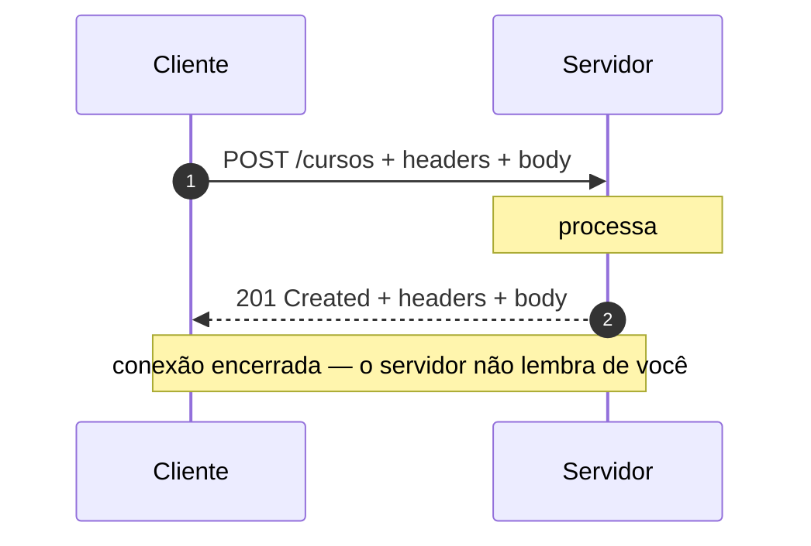
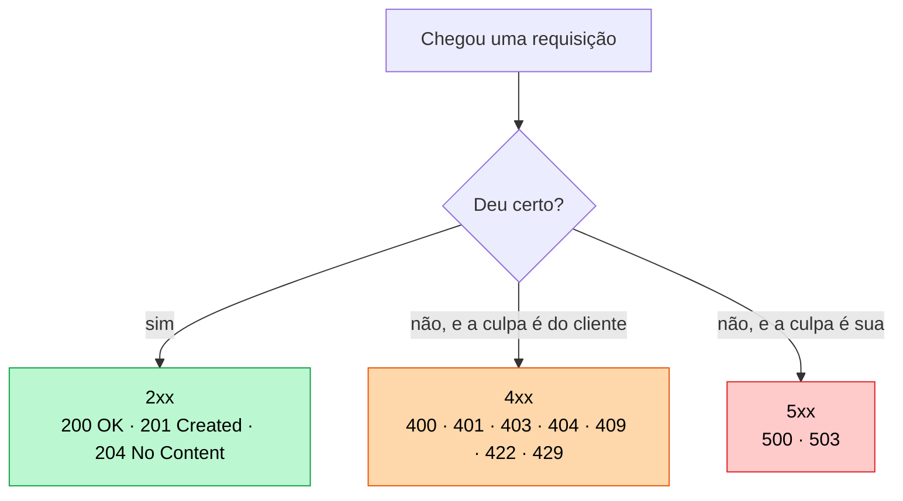
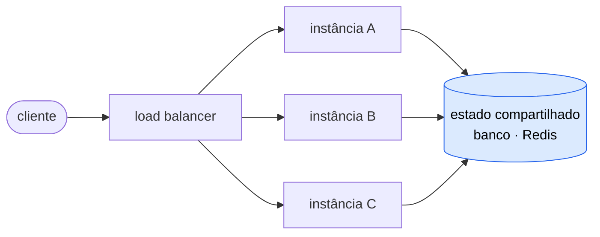

# 01 — Fundamentos de HTTP

**Em uma frase:** HTTP é o combinado de como um cliente pede algo a um servidor e
como o servidor responde.

<!-- sumario:inicio -->

**Sumário**

- [Por que importa](#por-que-importa)
- [Conceitos](#conceitos)
  - [O ciclo](#o-ciclo)
  - [O que viaja no fio, exatamente](#o-que-viaja-no-fio-exatamente)
  - [As três características que esse texto revela](#as-três-características-que-esse-texto-revela)
  - [Métodos](#métodos)
  - [Status codes](#status-codes)
  - [Headers que aparecem sempre](#headers-que-aparecem-sempre)
  - [Sem estado: para onde o estado vai](#sem-estado-para-onde-o-estado-vai)
- [Na prática](#na-prática)
- [Erros comuns](#erros-comuns)
- [Cheatsheet](#cheatsheet)
- [Os princípios deste módulo](#os-princípios-deste-módulo)
- [Se quiser ir mais fundo](#se-quiser-ir-mais-fundo)
- [Para ir além](#para-ir-além)
- [Pratique](#pratique)

<!-- sumario:fim -->

## Por que importa

- Todo framework web — Express incluso — é uma casca fina sobre isto.
- Debugar API é, quase sempre, ler uma requisição e uma resposta.
- Escolher o método e o status certo **é** o design da sua API.

## Conceitos

### O ciclo



O cliente pergunta, o servidor responde, e acabou. Nenhum dos dois continua
conversando depois disso.

### O que viaja no fio, exatamente

Antes de falar em "protocolo", vale ver a coisa. Isto é o que sai do seu
computador quando você envia um formulário — não uma representação didática, é
o conteúdo literal dos bytes:

```http
POST /cursos?rascunho=true HTTP/1.1     ← método, caminho, query
Host: api.exemplo.com                    ← headers: metadados
Content-Type: application/json
Authorization: Bearer abc123

{ "titulo": "Backend do zero" }          ← body: os dados
```

E isto é o que volta:

```http
HTTP/1.1 201 Created                     ← status code
Content-Type: application/json

{ "id": 7, "titulo": "Backend do zero" }
```

Repare em três detalhes da estrutura, porque eles são o protocolo inteiro:

1. **A primeira linha diz a intenção.** Na requisição: o que fazer (`POST`) e
   com o quê (`/cursos`). Na resposta: como foi (`201 Created`).
2. **Depois vêm os headers**, um por linha, no formato `Nome: valor`. São
   informações _sobre_ a mensagem — que formato ela tem, quem está mandando.
3. **Uma linha em branco separa os headers do corpo.** É só isso que marca onde
   os metadados acabam e os dados começam.

Você pode digitar esse texto à mão num socket e receber a resposta de volta: é o
que prova que HTTP é texto combinado, não mágica do navegador.

### As três características que esse texto revela

Agora dá para nomear. O que você acabou de ver mostra três coisas sobre HTTP, e
as três atravessam o curso inteiro:

**1. É texto legível.** Não há formato binário, nem estrutura comprimida: são
linhas que uma pessoa lê. Por isso dá para depurar com `curl` e ver a mensagem
exata — e é exatamente por isso que HTTPS não é opcional, porque qualquer um no
caminho lê o mesmo que você.

**2. É sem estado** (em inglês, _stateless_). O servidor não guarda nada entre
uma requisição e a seguinte. Repare que o `Authorization: Bearer abc123` está
_dentro_ da requisição: ele precisa ir junto **toda vez**, porque o servidor
esqueceu quem você é assim que respondeu a anterior. É daí que vêm token e
cookie (módulo 11).

**3. Quem começa é sempre o cliente.** Não existe, neste modelo, o servidor
mandando uma mensagem do nada. Se você quer ser avisado de algo, precisa
perguntar de novo — ou usar uma técnica que contorne isso, como polling, SSE e
WebSocket (módulo 18).

> **Nota:**
> "Uma requisição, uma resposta" é o modelo mental, não a implementação.
>
> Na prática a mesma conexão de rede é reaproveitada para várias requisições
> (**keep-alive**), em vez de abrir uma nova a cada vez — abrir conexão TCP é
> caro. E o HTTP/2 vai além: ele **multiplexa**, ou seja, deixa várias trocas
> acontecerem ao mesmo tempo dentro de uma conexão só.
>
> Nada disso muda o seu código; muda o desempenho (módulo 15). E o modelo mental
> continua valendo: cada requisição tem a sua resposta, e o servidor continua não
> lembrando de você entre elas.

### Métodos

| Método   | Para quê           | Seguro? | Idempotente? |
| -------- | ------------------ | ------- | ------------ |
| `GET`    | Buscar             | Sim     | Sim          |
| `POST`   | Criar              | Não     | **Não**      |
| `PUT`    | Substituir inteiro | Não     | Sim          |
| `PATCH`  | Alterar um pedaço  | Não     | Não          |
| `DELETE` | Remover            | Não     | Sim          |

- **Seguro** = não muda nada no servidor.
- **Idempotente** = repetir 10× dá o mesmo resultado de fazer 1×.

Por isso `POST` não é idempotente: mandar duas vezes cria dois recursos. É esse o
motivo do navegador avisar "reenviar formulário?" ao dar F5.

**Por que essas duas palavras importam de verdade:** elas não são taxonomia, são
o contrato com toda a infraestrutura entre você e o cliente.

| Quem depende          | Do quê                            | O que acontece se você mentir                                         |
| --------------------- | --------------------------------- | --------------------------------------------------------------------- |
| Navegador, CDN, proxy | `GET` ser **seguro**              | Eles fazem prefetch. Um `GET /livros/7/apagar` é executado sem clique |
| Cliente com timeout   | `PUT`/`DELETE` serem idempotentes | Ele repete sozinho. Se não for, o efeito acontece duas vezes          |
| Fila de jobs (17)     | O consumidor ser idempotente      | Todo job roda ao menos uma vez — às vezes duas                        |

> **Cuidado:** **A regra prática: se a ação muda estado, o método não pode ser `GET`.** Não
> importa quão conveniente seja o link. Já derrubaram bancos de dados inteiros
> porque um robô de indexação seguiu todos os `<a href="/apagar/1">` de um painel.

E quando a operação simplesmente não pode ser idempotente — criar um pedido é
criar um pedido — existe uma saída, a **chave de idempotência**. Ela está em
[Se quiser ir mais fundo](#se-quiser-ir-mais-fundo), no fim do módulo.

### Status codes



| Família | Significa          | Os que você usa                                                                                                                                   |
| ------- | ------------------ | ------------------------------------------------------------------------------------------------------------------------------------------------- |
| 2xx     | Deu certo          | `200` OK · `201` Created · `204` No Content                                                                                                       |
| 3xx     | Redireciona        | `301` permanente · `302` temporário · `304` não mudou                                                                                             |
| 4xx     | **Cliente errou**  | `400` inválido · `401` não autenticado · `403` sem permissão · `404` não existe · `409` conflito · `422` semântica inválida · `429` rápido demais |
| 5xx     | **Servidor errou** | `500` erro interno · `503` indisponível                                                                                                           |

> **Importante:** A distinção 4xx vs 5xx é a mais importante: **de quem é a culpa?** Bug seu nunca
> deve virar 400, e entrada ruim do cliente nunca deve virar 500.
>
> `401` vs `403`: "não sei quem você é" vs "sei quem você é, e você não pode".

**Por que o status code é decisão de arquitetura, não enfeite:** ele é a única
parte da resposta que **máquina** entende sem ler o seu JSON. Quem age com base
nele:

| Quem          | Faz o quê                                               |
| ------------- | ------------------------------------------------------- |
| Cliente HTTP  | Repete em `5xx` e `429`; **não** repete em `4xx`        |
| Seu alerta    | Mede taxa de `5xx`. `4xx` é rotina, `5xx` acorda alguém |
| Cache/CDN     | Guarda `200`, respeita `304`, não guarda `5xx`          |
| Load balancer | Tira a instância do ar se ela só devolve `503`          |

Mandar `200 {"erro": "não encontrado"}` quebra os quatro de uma vez: o cliente não
repete o que devia, o alerta nunca dispara, o CDN cacheia um erro, e a instância
doente continua recebendo tráfego. O status code é a **interface com a
infraestrutura**; o corpo é a interface com a pessoa.

**Os dois pares que mais se confundem:**

| Par            | A diferença                                                                     |
| -------------- | ------------------------------------------------------------------------------- |
| `400` vs `422` | `400`: não deu para entender (JSON quebrado). `422`: entendi, e a regra recusou |
| `401` vs `403` | `401`: renove a credencial. `403`: insistir não adianta                         |
| `404` vs `403` | `404` também serve para **esconder** que o recurso existe (ver módulo 11)       |
| `409` vs `400` | `409`: o corpo está certo, o **estado** é que impede                            |

O par `404`/`403` é o único que é decisão de **segurança**, não de precisão.
Responder `403` em `GET /usuarios/42` é dizer a um estranho "esse usuário
existe, você é que não pode ver" — a resposta em si já vazou o fato. Quando a
existência do recurso é informação sensível, devolver `404` para o que a pessoa
não pode ver é proposital, e a imprecisão é o preço.

Vale para dados de outra pessoa, repositório privado, documento por link. Não
vale para recurso público que só exige papel de admin: ali o `403` é honesto e
poupa o cliente de caçar um bug que não existe.

### Headers que aparecem sempre

| Header          | Para quê                                     |
| --------------- | -------------------------------------------- |
| `Content-Type`  | Formato do body (`application/json`)         |
| `Authorization` | Credencial (`Bearer <token>`)                |
| `Accept`        | Formato que o cliente quer de volta          |
| `Cache-Control` | Se e por quanto tempo pode guardar           |
| `Location`      | Onde está o recurso recém-criado (com `201`) |

### Sem estado: para onde o estado vai

Já vimos que o servidor não lembra de você entre requisições. Falta a parte que
tem consequência prática: **se o servidor não guarda, alguém guarda.** O estado
não desaparece por decreto.

Pense no caso mais simples. Você faz login e recebe um token. Onde esse "estou
logado" fica guardado?

- **No seu computador**, dentro do token ou do cookie que vai junto em toda
  requisição. O servidor lê e reconstrói quem você é, do zero, toda vez.
- **Num lugar que todas as máquinas do servidor enxergam** — um banco, um Redis.
  O servidor recebe só um identificador e vai buscar o resto ali.

O que não funciona é a terceira opção, que é a tentadora: guardar numa variável
dentro do processo. Ela parece funcionar perfeitamente enquanto você roda **uma**
máquina — e quebra no dia em que sobem duas.



Duas palavras do diagrama, caso sejam novas: uma **instância** é uma cópia do seu
servidor rodando; o **load balancer** é quem fica na frente delas e decide qual
cópia atende cada requisição. Ele reparte por carga, não por usuário — então
**duas requisições seguidas da mesma pessoa caem em instâncias diferentes**, e é
aí que a variável local vira problema.

É por isso que a caixa do estado compartilhado está fora das três: as três
precisam enxergar a mesma coisa.

Repare no que quebraria em cada caso concreto, se o estado morasse na memória de
uma instância só:

| O que ficaria na memória       | O que quebra                                                      |
| ------------------------------ | ----------------------------------------------------------------- |
| Sessão do usuário              | Ele desloga a cada duas requisições, sem motivo aparente          |
| Contador de rate limit (05)    | O limite triplica: 5 tentativas por instância = 15 no total       |
| Lista de tokens revogados (11) | "Sair de todos os dispositivos" não teria efeito nas outras       |
| Cache (15)                     | Cada instância cacheia sozinha, e invalidar todas fica impossível |

**A ideia que isso mostra:** o estado não some quando o servidor deixa de
guardá-lo — ele é **empurrado para as pontas**. Vai para o cliente, que passa a
carregá-lo em toda requisição, ou para um armazenamento que todas as instâncias
compartilham. O que ele não pode é morar na memória de uma delas.

**E o que isso custa:** repetição. O token viaja de novo a cada requisição, e o
servidor reconstrói o contexto toda vez, mesmo que a requisição anterior tenha
sido há 200ms. É trabalho desperdiçado, e é assumido de propósito.

O que se compra em troca é a escala: se nenhuma instância guarda nada especial,
adicionar a quarta máquina é só ligá-la. Nenhuma migração de dados, nenhuma
coordenação. É a troca que sustenta a web inteira, e um dos poucos casos em que
"menos eficiente por requisição" ganha com folga.

## Na prática

### curl: o cliente HTTP do terminal

`curl` monta uma requisição na mão e imprime a resposta. Sem flag nenhuma ele faz
um `GET` e mostra **só o body** — status e headers ficam escondidos.

Flag é traço + letra (`-i`) ou dois traços + a palavra inteira (`--include`): a
mesma coisa, na forma curta e na longa. Maiúscula é outra flag (`-i` inclui os
headers, `-I` manda um `HEAD`), e as curtas podem ser juntadas (`-is` = `-i -s`).

| Flag | Por extenso  | O que faz                                              |
| ---- | ------------ | ------------------------------------------------------ |
| `-i` | `--include`  | Imprime status e headers junto do body                 |
| `-X` | `--request`  | Escolhe o método: `-X DELETE`                          |
| `-H` | `--header`   | Manda um header: `-H "Content-Type: application/json"` |
| `-d` | `--data`     | Manda um body — e já troca o método para `POST`        |
| `-s` | `--silent`   | Esconde a barra de progresso, para usar com pipe       |
| `-L` | `--location` | Segue o `Location` de um `3xx`                         |

> **Atenção — aspas no Windows:** os exemplos deste repo usam **aspas simples**
> em volta do JSON (`-d '{"a":1}'`), que é o que funciona no **Git Bash**, no
> Linux e no macOS. O `cmd.exe` e o PowerShell **não** removem aspas simples: o
> corpo chega literalmente como `'{"a":1}'` e você recebe um `400` que parece bug
> do servidor, mas é do shell. Nesses dois, escape as aspas duplas:
>
> ```
> curl -X POST localhost:4001/eco -d "{\"a\":1}"
> ```
>
> Recomendação: use o Git Bash para acompanhar o repo — os comandos funcionam
> como estão escritos.

### Um servidor sem Express

Para você ver o trabalho manual:

```bash
node src/exemplos/01-05/01-http-sem-express/servidor.ts
```

Em outro terminal:

```bash
curl localhost:4001/
curl "localhost:4001/ola?nome=ana"
curl -X POST localhost:4001/eco -H "Content-Type: application/json" -d '{"a":1}'
curl -i localhost:4001/nao-existe
```

Repare no código ([`servidor.ts`](../../src/exemplos/01-05/01-http-sem-express/servidor.ts))
o que é feito na mão. É exatamente o que o Express vai automatizar no módulo 03:

| Na mão aqui                                    | No Express                |
| ---------------------------------------------- | ------------------------- |
| `if (rota === 'GET /ola')`                     | `app.get('/ola', ...)`    |
| Juntar os chunks do body                       | `app.use(express.json())` |
| `res.writeHead(200, {...})` + `JSON.stringify` | `res.json(...)`           |
| 404 no fim do handler                          | Automático                |

## Erros comuns

| Erro                               | O que acontece                              | Correção                     |
| ---------------------------------- | ------------------------------------------- | ---------------------------- |
| Esquecer `res.end()`               | O cliente fica esperando até dar timeout    | Toda rota tem que responder  |
| Responder duas vezes               | `ERR_HTTP_HEADERS_SENT`                     | `return` depois de responder |
| `200` para tudo                    | Cliente não sabe distinguir sucesso de erro | Use o status certo           |
| `500` quando o cliente mandou lixo | Some com o erro real do cliente             | Validação → `400`            |
| Verbo na URL (`/getCursos`)        | O método já diz a ação                      | `GET /cursos`                |
| Achar que query param é número     | `?idade=30` chega como `"30"`               | Converta e valide            |
| `curl -d` sem `-H Content-Type`    | curl envia `x-www-form-urlencoded`          | Passe o header na mão        |

## Cheatsheet

```
GET    /cursos        lista
GET    /cursos/7      um item
POST   /cursos        cria          → 201
PUT    /cursos/7      substitui     → 200
PATCH  /cursos/7      altera parte  → 200
DELETE /cursos/7      remove        → 204

2xx ok · 3xx redireciona · 4xx culpa do cliente · 5xx culpa sua
```

## Os princípios deste módulo

Recapitulando o que o módulo mostrou — cada linha é uma conclusão que você já
viu acontecer aqui, não uma regra para decorar:

| A ideia                                                                                                                   | Onde volta |
| ------------------------------------------------------------------------------------------------------------------------- | ---------- |
| HTTP é texto legível, o servidor não lembra de você, e quem começa a conversa é sempre o cliente.                         | 11, 15, 18 |
| O estado não some por o servidor não guardar — ele vai para o cliente ou para um lugar que todas as cópias veem.          | 05, 11, 15 |
| O status code é lido por máquina (cliente, cache, alerta); o corpo é lido por gente. Mentir no status quebra as máquinas. | 06, 14     |
| Se a ação muda alguma coisa no servidor, o método não pode ser `GET` — porque `GET` promete não mudar nada.               | 03, 13     |
| Uma operação que pode ser repetida sem estragar nada é o que permite ao cliente tentar de novo depois de um timeout.      | 03, 15, 17 |

## Se quiser ir mais fundo

Nada aqui é necessário para escrever a sua primeira API. É o que fica de fora
da primeira leitura e vale a pena quando você voltar.

### A chave de idempotência

Vimos que `POST` não é idempotente: mandar duas vezes cria dois recursos. Isso é
um problema real quando o cliente perde a conexão **depois** de o servidor
processar. Ele não sabe se deu certo. Se tentar de novo, pode cobrar duas vezes;
se não tentar, pode não ter cobrado nenhuma.

A solução é o cliente decidir a identidade da tentativa **antes** de mandar:

```http
POST /pagamentos HTTP/1.1
Idempotency-Key: 7f3a9c21-4e8b-11ef-9f2d-0242ac120002
Content-Type: application/json

{ "valor": 5000, "cartao": "..." }
```

O servidor guarda o resultado associado àquela chave. Se a mesma chave chegar de
novo, ele **não refaz nada** — devolve a resposta que já tinha guardado. O
cliente pode repetir à vontade.

Repare que a idempotência não virou propriedade do método `POST`; ela virou
responsabilidade do servidor, comprada com armazenamento. É assim que Stripe,
PayPal e praticamente toda API de pagamento resolvem o problema.

### As versões do protocolo

Tudo neste módulo vale para as três versões — o que muda é o transporte, não o
significado.

| Versão   | O que mudou                                                                                   | Muda seu código? |
| -------- | --------------------------------------------------------------------------------------------- | ---------------- |
| HTTP/1.1 | Texto puro, como você viu aqui. Uma requisição por vez em cada conexão.                       | é a referência   |
| HTTP/2   | O mesmo significado, mas em binário e **multiplexado**: várias trocas na mesma conexão.       | não              |
| HTTP/3   | Igual ao 2, mas em cima de UDP (QUIC) em vez de TCP — reconecta mais rápido em rede instável. | não              |

O ponto que importa: **método, status, headers e corpo são idênticos nas três**.
Você continua escrevendo `res.status(201).json(...)`. Quem escolhe a versão é a
infraestrutura (servidor, CDN, navegador), não o seu handler.

## Para ir além

A especificação é surpreendentemente legível — e é a autoridade quando alguém discute qual status usar.

- **[RFC 9110 — HTTP Semantics](https://www.rfc-editor.org/rfc/rfc9110.html)**
  A norma atual (STD 97, 2022), que substituiu as antigas RFC 7230-7235. As seções 9 (métodos) e 15 (status) respondem quase toda dúvida de design de API. Confirma o que este módulo diz: idempotência é sobre **estado do servidor**, não sobre a resposta.
- **[MDN — HTTP](https://developer.mozilla.org/pt-BR/docs/Web/HTTP)**
  A mesma informação em português e com exemplos. É onde consultar no dia a dia; a RFC é para quando a MDN não basta.
- **[MDN — Referência de status HTTP](https://developer.mozilla.org/pt-BR/docs/Web/HTTP/Reference/Status)**
  Um verbete por código, com o significado exato e quando usar. É a página para deixar aberta enquanto desenha uma API.
- **[OWASP — _REST Security Cheat Sheet_](https://cheatsheetseries.owasp.org/cheatsheets/REST_Security_Cheat_Sheet.html)**
  O que fazer e o que evitar numa API HTTP, do ponto de vista de segurança. Curto, e antecipa o módulo 13.

## Pratique

👉 [`exercicios/01-05/01-fundamentos-http/`](../../exercicios/01-05/01-fundamentos-http/)
