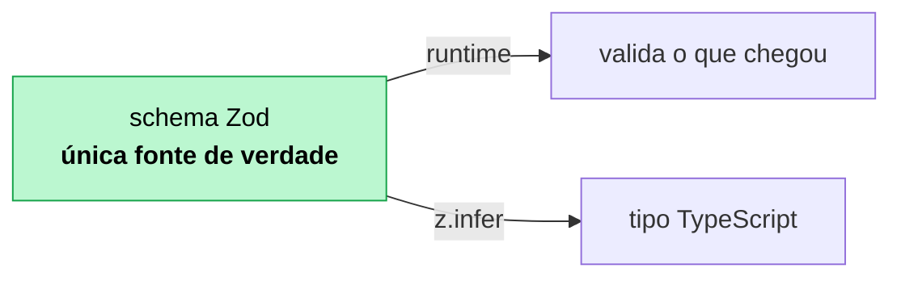
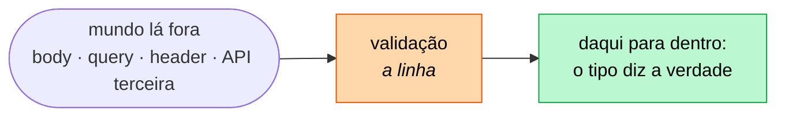
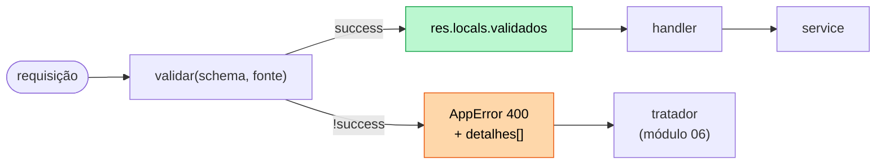

# 07 — Validação e contratos de entrada

**Em uma frase:** um schema Zod descreve o que a entrada pode ser — e o
TypeScript deriva o tipo daquele mesmo schema, sem você escrever duas vezes.

<!-- sumario:inicio -->

**Sumário**

- [Por que importa](#por-que-importa)
- [Conceitos](#conceitos)
  - [A dor: a validação escrita na mão](#a-dor-a-validação-escrita-na-mão)
  - [Por que você não pode simplesmente confiar](#por-que-você-não-pode-simplesmente-confiar)
  - [A saída: uma fonte de verdade só](#a-saída-uma-fonte-de-verdade-só)
  - [Onde a validação acontece, e por que ali](#onde-a-validação-acontece-e-por-que-ali)
  - [z.input vs z.output](#zinput-vs-zoutput)
  - [.strict() — rejeite o que você não conhece](#strict-rejeite-o-que-você-não-conhece)
  - [Query param: tudo é string](#query-param-tudo-é-string)
  - [A armadilha do .partial() para PATCH](#a-armadilha-do-partial-para-patch)
  - [O middleware validar(schema, fonte)](#o-middleware-validarschema-fonte)
  - [parse vs safeParse](#parse-vs-safeparse)
  - [Formato do erro](#formato-do-erro)
  - [Validação vs regra de negócio](#validação-vs-regra-de-negócio)
- [Na prática](#na-prática)
- [Erros comuns](#erros-comuns)
- [Cheatsheet](#cheatsheet)
- [Os princípios deste módulo](#os-princípios-deste-módulo)
- [Para ir além](#para-ir-além)
- [Pratique](#pratique)

<!-- sumario:fim -->

## Por que importa

- **Nunca confie no cliente.** `req.body` é `any`: um objeto que chegou pela rede.
- Validação manual e `type` são duas verdades que divergem no primeiro campo novo.
- Erro de validação bem formatado é a diferença entre o front marcar o campo certo
  e mostrar "algo deu errado".

## Conceitos

### A dor: a validação escrita na mão

Volte ao [módulo 03](../01-05/03-express-basico.md). Cada rota que aceitava dados
começava assim:

```ts
// 15 linhas antes de a rota fazer qualquer coisa útil
if (typeof titulo !== 'string' || titulo.trim() === '') {
  return res.status(400).json({ erro: 'titulo é obrigatório' });
}
if (typeof horas !== 'number' || horas <= 0) {
  return res.status(400).json({ erro: 'horas precisa ser positivo' });
}

// e, em outro arquivo, a mesma regra escrita de novo — desta vez em tipo:
type Curso = { titulo: string; horas: number };
```

Três problemas moram aí, e o terceiro é o pior.

**Um:** é longo, e cresce com cada campo novo.

**Dois:** ele para no primeiro erro. Quem mandou o formulário com três campos
errados corrige um, reenvia, descobre o segundo, corrige, reenvia. Uma volta por
campo.

**Três, e este é o que causa bug:** a regra está escrita em **dois lugares**. O
`if` diz que `horas` é número positivo; o `type` diz que `horas` é `number`. Nada
obriga os dois a concordarem. No dia em que você acrescenta um campo no `type` e
esquece o `if`, o TypeScript não reclama — porque `req.body` é `any`, e `any`
aceita qualquer coisa.

### Por que você não pode simplesmente confiar

Vale ser explícito sobre a premissa, porque ela não é sobre desconfiar de gente.

Todo dado que chega de fora é suspeito: corpo, query, parâmetro de rota, header,
arquivo enviado, resposta de uma API de terceiro. Não porque quem está do outro
lado seja mal-intencionado — a maioria não é —, mas porque ele é **um cliente que
você não controla**. Um dia ele vai mandar `horas: "8"` com aspas, porque o
formulário dele lê tudo como texto e ninguém converteu.

E há quatro coisas para conferir, não duas:

| O que conferir      | Exemplo do que barra                          |
| ------------------- | --------------------------------------------- |
| **tipo**            | `horas: "8"` quando deveria ser número        |
| **formato**         | `contato: "arroba"` quando deveria ser e-mail |
| **obrigatoriedade** | `titulo` ausente                              |
| **limites**         | `titulo` com 5 MB de texto                    |

> **Importante:**
> **`limites` é o que mais se esquece, e o que mais custa.** Repare que
> `?porPagina=999999` não é dado inválido: o tipo está certo, o formato está
> certo, o campo veio. É um pedido perfeitamente formado que faz o servidor
> tentar carregar um milhão de registros na memória.
>
> Todo campo aberto — texto, lista, número, upload — precisa de um teto. É
> validação **e** é defesa contra negação de serviço (módulo 13).

### A saída: uma fonte de verdade só

```ts
export const criarCursoSchema = z
  .object({
    titulo: z.string().trim().min(3, '`titulo` precisa de 3+ caracteres').max(120),
    horas: z.number().int().positive().max(500),
    publicado: z.boolean().default(false),
    nivel: z.enum(['iniciante', 'intermediario', 'avancado']).default('iniciante'),
    contato: z.email().optional(), // no Zod 4; `z.string().email()` está deprecado
  })
  .strict(); // ← rejeita campo desconhecido

export type CriarCurso = z.infer<typeof criarCursoSchema>; // o tipo vem do schema
```



Mudar a regra muda o tipo, e o TypeScript aponta todo lugar que precisa
acompanhar. É o oposto de manter `type` e `validar()` sincronizados na mão.

Esse é o terceiro problema da lista lá de cima, resolvido. E vale nomear o que
aconteceu, porque a ideia é maior que o Zod: **duas descrições da mesma regra
sempre acabam divergindo — a única questão é quando.** Nada obriga o `type` e o
`if` a concordarem, e nada avisa no dia em que param.

Derivar um do outro elimina a categoria inteira de bug, porque não há mais dois.
É a mesma ideia que volta em vários pontos do curso:

| Onde                             | O derivado                       |
| -------------------------------- | -------------------------------- |
| Zod (07)                         | o tipo vem do schema             |
| `ReturnType<typeof criarX>` (08) | o tipo do service vem da fábrica |
| Prisma (10)                      | o client tipado vem do schema    |
| OpenAPI (20)                     | a documentação vem do schema Zod |

> **Dica:**
> **O custo:** o tipo passa a depender da biblioteca de validação. É aceitável no
> contrato HTTP, e é justamente por isso que o [módulo 08](./08-arquitetura-em-camadas/README.md)
> escreve os tipos de **domínio** à mão: o negócio não deve depender do Zod. O
> schema descreve o que a API aceita; o domínio, o que o negócio é. Eles se
> parecem hoje e podem divergir amanhã.

### Onde a validação acontece, e por que ali

Com o schema pronto, falta decidir **quando** ele roda. A resposta é: o mais cedo
possível, antes de qualquer código seu tocar no dado.

Isso desenha uma linha no seu sistema. De um lado dela, o dado é o que chegou pela
rede e pode ser qualquer coisa. Do outro, ele já passou pelo schema — e daí para
frente o seu código pode simplesmente confiar:



O ganho de ter uma linha nítida fica claro quando você imagina o contrário. Sem
ela, cada função ao longo do caminho precisa se perguntar "será que isto já foi
checado?" — e, na dúvida, checa de novo. A desconfiança se espalha, a checagem se
repete, e a que **faltou** é invisível, porque não há um lugar onde olhar.

| Validar na linha, uma vez       | Validar espalhado, quando lembra                |
| ------------------------------- | ----------------------------------------------- |
| Um lugar só, fácil de auditar   | Checagem repetida, e a que falta é invisível    |
| Erro chega junto e completo     | Uma mensagem por vez, o usuário corrige em loop |
| O tipo depois dela é verdadeiro | `any` viajando três camadas adiante             |

### `z.input` vs `z.output`

Um schema com `.default()` gera **dois** tipos:

```ts
type Entrada = z.input<typeof criarCursoSchema>; // publicado?: boolean
type Saida = z.output<typeof criarCursoSchema>; // publicado: boolean (garantido)
```

`z.infer` é apelido de `z.output` — é o que você quer 90% das vezes.

### `.strict()` — rejeite o que você não conhece

> **Atenção:**
> Sem ele, o Zod **descarta em silêncio** campo desconhecido. O cliente que
> digitou `hora` em vez de `horas` recebe "campo obrigatório" sem entender por
> quê. Com `.strict()`, ele recebe `Unrecognized key: "hora"`.

Segurança também: sem `.strict()`, `{ ...req.body }` num `Object.assign` pode
escrever campos que você nunca quis expor (`admin: true`).

### Query param: tudo é string

```ts
maxHoras: z.coerce.number().int().positive().optional(), // "5" → 5
```

> **Cuidado:**
> **Nunca `z.coerce.boolean()` em query:** `Boolean("false") === true`, então
> `?publicado=false` filtraria os publicados.

Mapeie explicitamente:

```ts
publicado: z.enum(['true', 'false']).transform((v) => v === 'true').optional(),
```

### A armadilha do `.partial()` para PATCH

```ts
const atualizar = criarCursoSchema.partial(); // ❌ parece certo, não é
```

> **Cuidado:**
> `.partial()` torna o campo opcional, **mas o `.default()` continua valendo**.
> Um `PATCH { "horas": 6 }` sai da validação com `publicado: false` e
> `nivel: 'iniciante'` — e sobrescreve o que estava salvo. PATCH que apaga campo
> em silêncio é dos bugs mais difíceis de perceber.

Correto: monte o schema de atualização a partir dos campos **sem** default.

```ts
const campos = { titulo: z.string()..., publicado: z.boolean() }; // sem default
export const criarSchema = z.object({ ...campos, publicado: campos.publicado.default(false) });
export const atualizarSchema = z.object(campos).partial().strict();
```

### O middleware `validar(schema, fonte)`

```ts
export function validar(schema: ZodType, fonte: 'body' | 'query' | 'params' = 'body') {
  return (req, res, next) => {
    const resultado = schema.safeParse(req[fonte]);
    if (!resultado.success) {
      throw new AppError('Dados inválidos', 400, formatarErros(resultado.error));
    }
    res.locals.validados = { ...res.locals.validados, [fonte]: resultado.data };
    next();
  };
}
```

Dois detalhes fáceis de errar:

**`req.body ?? {}`.** Sem `Content-Type: application/json`, o Express 5 deixa
`req.body` como `undefined` ([módulo 03](../01-05/03-express-basico.md)). Passar
`undefined` a um `z.object()` produz `expected object, received undefined` — e o
cliente não descobre qual campo falta. Com `{}`, ele recebe a lista de campos
obrigatórios.

> **Cuidado:**
> **Não faça `req[fonte] = resultado.data`** — e é o que quase todo tutorial faz.
> No Express 5 isso explode para query:
>
> ```
> TypeError: Cannot set property query of #<IncomingMessage> which has only a getter
> ```

O Express 5 transformou `req.query` em getter com parse lazy. `req.body` ainda é
gravável, `req.query` não. Guardar em `res.locals` funciona para as três fontes e
preserva o dado original (útil em log de auditoria).

Para ler com tipo, sem `as`:

```ts
export function validados<T>(res: Response, _schema: ZodType<T>, fonte = 'body'): T {
  // o schema é passado de novo só para o TS inferir o retorno
}

const { id } = validados(res, idSchema, 'params'); // id: number
```

### `parse` vs `safeParse`

|                | Comportamento                               | Quando usar                                   |
| -------------- | ------------------------------------------- | --------------------------------------------- |
| `parse(x)`     | Lança `ZodError`                            | Script, seed, código que já está em try/catch |
| `safeParse(x)` | `{ success, data }` \| `{ success, error }` | Middleware — você quer traduzir o erro        |

### Formato do erro

```json
{
  "erro": "Dados inválidos",
  "status": 400,
  "detalhes": [
    {
      "campo": "titulo",
      "mensagem": "`titulo` precisa de 3+ caracteres",
      "codigo": "too_small"
    },
    { "campo": "horas", "mensagem": "`horas` deve ser positivo", "codigo": "too_small" }
  ]
}
```

O Zod devolve **todos** os problemas de uma vez, não só o primeiro — o usuário
corrige o formulário inteiro numa passada. E `campo` é o que permite ao front
marcar o input certo.

### Validação vs regra de negócio

|                    | Validação             | Regra de negócio                       |
| ------------------ | --------------------- | -------------------------------------- |
| Pergunta           | "Está bem formado?"   | "É permitido agora?"                   |
| Precisa dos dados? | Não                   | Sim                                    |
| Exemplo            | `titulo` tem 3+ chars | Não existe outro curso com esse título |
| Onde               | Schema, no middleware | Service / handler                      |
| Status             | `400`                 | `409`, `403`, `422`                    |

O que separa as duas colunas é uma diferença só, e ela explica todas as outras
linhas da tabela: **a validação olha apenas para o que chegou; a regra de negócio
precisa olhar para o mundo.**

"Este título tem 3 caracteres?" se responde com o texto na mão. "Já existe outro
curso com este título?" exige ir ao banco perguntar — e a resposta muda conforme
o tempo passa.

Em termos de código: a validação é uma [função pura](../00-glossario.md), e a
regra de negócio não é. A consequência disso é bem concreta, e não é sobre
organização de pastas:

| Propriedade                      | Validação                    | Regra de negócio                   |
| -------------------------------- | ---------------------------- | ---------------------------------- |
| Mesma entrada → mesmo resultado? | **sempre**                   | não: hoje passa, amanhã é conflito |
| Precisa de I/O?                  | não                          | sim                                |
| Dá para rodar no **cliente**?    | sim (o front reusa o schema) | não                                |
| Pode ser cacheada?               | sim                          | não                                |

Por isso a validação pode acontecer no navegador **e** no servidor com o mesmo
schema — e por isso a regra de negócio só pode acontecer no servidor. O front que
checa "e-mail já existe" está fazendo uma sugestão de UX; a verdade é a checagem
do servidor, sempre, porque entre a pergunta e a gravação alguém pode ter
cadastrado.

> **Atenção:**
> O Zod não tem como saber que o título já existe. Não tente forçá-lo com
> `.refine()` assíncrono acessando o banco: isso mistura camadas, torna o schema
> impossível de reusar em teste e no front, e **ainda não resolve** — entre o
> `.refine()` e o `INSERT` existe uma janela de corrida. Quem garante unicidade
> de verdade é a constraint `UNIQUE` no banco ([módulo 09](./09-sqlite-e-sql.md)).

`.refine()` serve para regra entre **campos da mesma entrada**:

```ts
z.object({ inicio: z.coerce.date(), fim: z.coerce.date() }).refine(
  (d) => d.fim > d.inicio,
  { message: '`fim` deve ser depois', path: ['fim'] },
);
```

O `path` é o que faz o erro apontar para um campo — sem ele o front não sabe onde
marcar.

## Na prática

```bash
node src/exemplos/06-10/07-validacao/servidor.ts
```

```bash
B=localhost:5055
curl "$B/cursos?maxHoras=5"          # coerce: "5" → 5
curl "$B/cursos?publicado=false"     # o boolean feito à mão
curl "$B/cursos?maxHoras=abc"        # 400 com campo e código
curl $B/cursos/abc                   # 400: id não é número

curl -X POST $B/cursos -H 'Content-Type: application/json' \
  -d '{"titulo":"  Zod na prática  ","horas":3,"ano":2026}'   # trim + defaults

curl -X POST $B/cursos -H 'Content-Type: application/json' \
  -d '{"titulo":"ab","horas":-1,"ano":1200}'    # TRÊS erros de uma vez

curl -X POST $B/cursos -H 'Content-Type: application/json' \
  -d '{"titulo":"Teste ok","hora":3,"ano":2026}' # strict: Unrecognized key "hora"

curl -X PATCH $B/cursos/1 -H 'Content-Type: application/json' -d '{"horas":6}'
# ↑ confirme que `publicado` NÃO virou false

curl -X POST $B/periodos -H 'Content-Type: application/json' \
  -d '{"inicio":"2026-03-01","fim":"2026-01-01"}'  # refine
```

## Erros comuns

| Erro                                              | O que acontece                                                                                                                                                                          | Correção                                     |
| ------------------------------------------------- | --------------------------------------------------------------------------------------------------------------------------------------------------------------------------------------- | -------------------------------------------- |
| Confiar em `req.body`                             | É `any`; qualquer coisa passa                                                                                                                                                           | Sempre um schema                             |
| Sem `.strict()`                                   | Campo com typo é descartado calado                                                                                                                                                      | `.strict()`                                  |
| `criarSchema.partial()` no PATCH                  | Defaults sobrescrevem o salvo                                                                                                                                                           | Campos sem default                           |
| `req.query = data` no Express 5                   | `TypeError`: só tem getter                                                                                                                                                              | `res.locals`                                 |
| `safeParse(req.body)` sem `?? {}`                 | "expected object, received undefined"                                                                                                                                                   | `req.body ?? {}`                             |
| `z.coerce.boolean()` em query                     | `"false"` vira `true`                                                                                                                                                                   | `enum + transform`                           |
| `z.number()` em query                             | Sempre falha: chega string                                                                                                                                                              | `z.coerce.number()`                          |
| Só o primeiro erro na resposta                    | Usuário corrige um por vez                                                                                                                                                              | Devolva `issues` inteiro                     |
| Erro sem nome de campo                            | Front não sabe onde marcar                                                                                                                                                              | `path` no `.refine()`                        |
| `.refine()` batendo no banco                      | Schema deixa de ser testável                                                                                                                                                            | Regra de negócio no service                  |
| Validar só na entrada, tipar na mão               | Duas verdades divergem                                                                                                                                                                  | `z.infer`                                    |
| Ler o campo pelo `path` no `unrecognized_keys`    | O `path` vem **vazio**: quem foi reprovado é o objeto, não um campo. A lista sai com `(raiz)` e esconde o nome que o cliente precisa corrigir                                           | As chaves estão em `issue.keys`              |
| `.refine()` supondo que o `.regex()` acima barrou | As checagens **não param na primeira que falha**: o refine roda sobre a entrada já reprovada. Se ele fizer `new Date(x).toISOString()`, o `Invalid Date` **lança** e o 422 vira **500** | O refine tem que aguentar entrada malformada |

## Cheatsheet

```ts
z.string().trim().min(3).max(120).email().url().uuid().regex(/x/)
z.number().int().positive().min(0).max(100)
z.boolean()  z.date()  z.literal('x')
z.enum(['a', 'b'])                       // sem `enum` do TypeScript
z.array(z.string()).min(1).max(5)
z.object({}).strict()                    // rejeita chave extra
z.coerce.number()                        // "5" → 5   (para query/params)

.optional()   // pode faltar → undefined
.nullable()   // aceita null
.default(x)   // pode faltar → x na saída
.transform(fn) .refine(fn, { message, path })
schema.partial()  .pick({a:true})  .omit({b:true})  .extend({c:...})

schema.parse(x)      // lança ZodError
schema.safeParse(x)  // { success, data | error }
z.infer<typeof s>    // = z.output; o tipo derivado
z.input<typeof s>    // antes dos defaults
```



## Os princípios deste módulo

Recapitulando — cada linha é uma conclusão que o módulo mostrou acontecer:

| A ideia                                                                                                                    | Onde volta |
| -------------------------------------------------------------------------------------------------------------------------- | ---------- |
| A validação é a linha do sistema: depois dela o tipo diz a verdade, antes dela o dado pode ser qualquer coisa.             | 08, 11, 13 |
| A mesma regra escrita em dois lugares vai divergir; a única questão é quando. Derive um do outro e não haverá dois.        | 08, 10, 20 |
| Todo campo aberto precisa de um teto. `?porPagina=999999` é um pedido bem formado que derruba o servidor.                  | 13, 15     |
| A validação olha só para o que chegou; a regra de negócio precisa consultar o mundo — e por isso só ela exige ir ao banco. | 08, 11     |
| Campo que você não conhece é rejeitado, não descartado em silêncio. Descartar esconde o erro de digitação de quem chamou.  | 13         |

## Para ir além

- **[Zod — documentação oficial](https://zod.dev/)**
  A referência de schemas, `safeParse` e `z.infer`. Confira a v4: `z.string().email()` saiu em favor de `z.email()`.
- **[OWASP — _Input Validation Cheat Sheet_](https://cheatsheetseries.owasp.org/cheatsheets/Input_Validation_Cheat_Sheet.html)**
  Por que validar por **lista de permissão** e não por lista de bloqueio — o princípio que sustenta este módulo.
- **[JSON Schema](https://json-schema.org/)**
  O padrão independente de linguagem para descrever dados. É o que o OpenAPI usa no módulo 20.

## Pratique

👉 [`exercicios/06-10/07-validacao/`](../../exercicios/06-10/07-validacao/)
