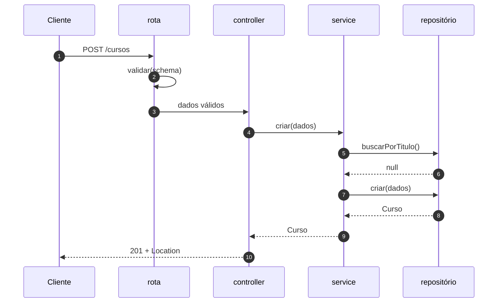
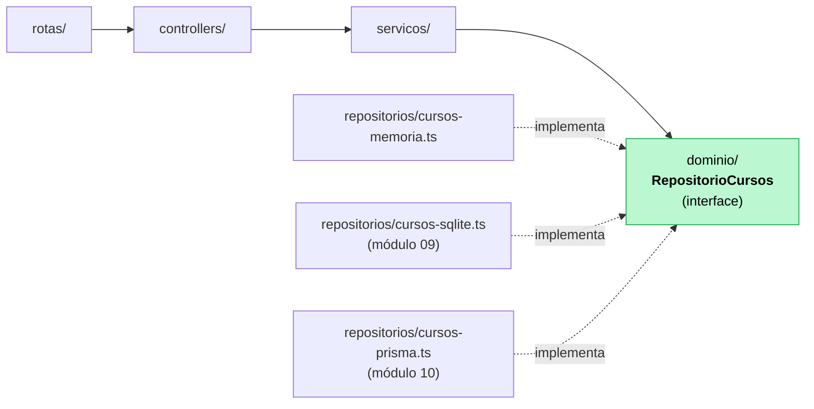

# 08 — Arquitetura em camadas

**Em uma frase:** separar "responder HTTP", "decidir a regra" e "guardar o dado"
em arquivos diferentes, com as dependências apontando sempre para dentro.

<!-- sumario:inicio -->

**Sumário**

- [Por que importa](#por-que-importa)
- [Conceitos](#conceitos)
  - [As quatro camadas](#as-quatro-camadas)
  - [A regra da direção das dependências](#a-regra-da-direção-das-dependências)
  - [O contrato do repositório](#o-contrato-do-repositório)
  - [Injeção de dependência sem framework](#injeção-de-dependência-sem-framework)
  - [Composition root](#composition-root)
  - [O que vai em cada camada, na dúvida](#o-que-vai-em-cada-camada-na-dúvida)
  - [DTO](#dto)
  - [A pegadinha do exactOptionalPropertyTypes](#a-pegadinha-do-exactoptionalpropertytypes)
  - [Quando não usar camadas](#quando-não-usar-camadas)
  - [Clean Architecture e DDD, sem hype](#clean-architecture-e-ddd-sem-hype)
- [Na prática](#na-prática)
- [Erros comuns](#erros-comuns)
- [Cheatsheet](#cheatsheet)
- [Os princípios deste módulo](#os-princípios-deste-módulo)
- [Para ir além](#para-ir-além)
- [Pratique](#pratique)

<!-- sumario:fim -->

## Por que importa

- Rota de 200 linhas fazendo tudo é impossível de testar e de reusar.
- A regra de negócio precisa valer também no worker de fila, no seed, no CLI.
- Trocar o banco deve mexer em **um** arquivo, não em vinte.

## Conceitos

### As quatro camadas

| Camada          | Responsabilidade                   | Conhece              | **Não** conhece |
| --------------- | ---------------------------------- | -------------------- | --------------- |
| **Rota**        | Mapear caminho+método → controller | Express, controller  | regra, banco    |
| **Controller**  | Traduzir HTTP ↔ service            | `req`/`res`, status  | regra, banco    |
| **Service**     | **Regras de negócio**              | domínio, repositório | HTTP, SQL       |
| **Repositório** | Guardar e buscar                   | banco                | regra, HTTP     |

E no centro, o **domínio**: tipos e a interface do repositório. Não importa nada.



### A regra da direção das dependências



> **Importante:**
> As flechas apontam para **dentro**. O service depende da _interface_, nunca do
> arquivo concreto — e é isso que faz trocar array por SQLite (módulo 09) por
> Prisma (10) não alterar uma linha do service.

> **Dica:**
> Teste rápido do seu código: se `servicos/*.ts` importa `express`, alguma
> responsabilidade escorregou de camada.

Vale entender de onde vem essa regra, porque ela não é arbitrária.

Pegue as peças do seu sistema e ordene por uma pergunta só: **com que frequência
isto muda?**

| Muda...         | Peça                                  | Quando muda              |
| --------------- | ------------------------------------- | ------------------------ |
| Muito           | Framework, driver de banco, ORM       | você troca de ferramenta |
| Às vezes        | Rota, controller, formato de resposta | a API evolui             |
| **Quase nunca** | **Regra de negócio, domínio**         | o **negócio** muda       |

Agora repare no que acontece se você deixar a seta apontar para o lado errado.

"Livro emprestado não pode ser removido" é uma regra que continua verdadeira com
Express, com Fastify, com SQLite, com Postgres, e dentro de um script de linha de
comando que não tem servidor nenhum. Ela é do negócio, não da ferramenta.

Mas se o arquivo que contém essa regra tiver um `import express`, ela passa a
depender do Express. E aí, no dia em que o Express mudar — versão nova, API
diferente, ou a decisão de trocar de framework —, a regra de negócio precisa ser
mexida junto. O que quase nunca muda virou refém do que muda toda hora.

Daí a regra, que é a única coisa que vale decorar aqui: **quem é mais estável não
pode depender de quem muda mais.**

A interface do repositório é o que costura isso. Repare onde ela mora: em
`dominio/`, o lado estável. E repare no sentido das setas do diagrama — o service
**chama** o repositório, mas **depende** de um tipo que ele próprio define. A
dependência aponta ao contrário da execução.

É por isso que o nome disso é _inversão de dependência_: o que foi invertido é a
direção da seta em relação ao que você esperaria.

> **Nota:**
> A prova disso não é teórica neste repositório: rode
> `diff -rq exercicios/06-10/08-camadas/solucao/servicos exercicios/06-10/10-prisma/solucao/servicos`.
> Entre um array em memória e o Prisma, os services são **idênticos**.

### O contrato do repositório

```ts
// dominio/curso.ts — nenhum import
export type RepositorioCursos = {
  listar(filtro: FiltroCursos): Promise<Curso[]>;
  buscarPorId(id: number): Promise<Curso | null>;
  buscarPorTitulo(titulo: string): Promise<Curso | null>;
  criar(dados: NovoCurso): Promise<Curso>;
  atualizar(id: number, dados: AtualizacaoCurso): Promise<Curso | null>;
  remover(id: number): Promise<boolean>;
};
```

Dois detalhes deliberados:

1. **`Promise` mesmo na versão em memória**, que é síncrona. A interface tem de
   servir ao banco de verdade, que é assíncrono. Se fosse síncrona hoje, o
   módulo 09 mudaria a assinatura e o service inteiro junto.
2. **A interface fala a linguagem do domínio.** Nada de `findBySQL`, nada de
   retorno com formato de linha de banco. `Curso`, não `CursoRow`.

### Injeção de dependência sem framework

```ts
export function criarServicoCursos(repositorio: RepositorioCursos) {
  return {
    async criar(dados: NovoCurso) {
      const existente = await repositorio.buscarPorTitulo(dados.titulo);
      if (existente) throw conflito('Já existe um curso com esse título');
      return repositorio.criar(dados);
    },
  };
}
```

Repare no que mudou em relação ao óbvio: o repositório **não** foi importado no
topo do arquivo. Ele chega como argumento.

Compare as duas versões pensando em quem decide:

```ts
// ❌ Importado: a decisão de qual banco usar está tomada, aqui, para sempre.
import { repositorioPrisma } from '../../repositorios/cursos-prisma.ts';

// ✅ Recebido: este arquivo não decide nada. Quem chamar decide.
export function criarServicoCursos(repositorio: RepositorioCursos) { ... }
```

Na primeira versão, testar esse service exige fazer o Node devolver outro módulo
quando alguém importa aquele caminho — o que é frágil, lento e quebra quando o
arquivo muda de lugar. Na segunda, testar é passar outro argumento.

**A ideia geral:** uma dependência importada é uma decisão já tomada; uma
dependência recebida é uma decisão adiada. E adiar aqui não é indecisão — é
deixar a escolha para quem tem contexto para fazê-la, que é sempre outro lugar:

| Quem monta              | Passa                    |
| ----------------------- | ------------------------ |
| `servidor.ts`           | o repositório de verdade |
| O teste (módulo 12)     | um em memória, isolado   |
| Um script de importação | um que grava em lote     |
| Um worker de fila (17)  | o mesmo de produção      |

> **Nota:**
> Isso tem um nome grande, _injeção de dependência_, e é **um parâmetro de
> função**. Nada de NestJS, decorator ou container aqui.
>
> O que os frameworks de injeção acrescentam é resolver automaticamente quem
> passa o quê — útil quando existem centenas de peças para montar, e
> desnecessário quando você consegue escrever a montagem à mão em cinco linhas.

> **Atenção:**
> **O custo é real:** o `servidor.ts` cresce, e ler "o que este service usa?"
> exige olhar quem o construiu, não o topo do arquivo. Em projeto pequeno isso é
> burocracia. A linha divisória prática: injete o que **tem mais de uma
> implementação plausível** (banco, envio de e-mail, relógio, gerador de id) e
> importe o resto direto.

O tipo sai de graça:

```ts
export type ServicoCursos = ReturnType<typeof criarServicoCursos>;
```

### Composition root

Um único arquivo conhece todas as camadas e monta de dentro para fora:

```ts
// servidor.ts
const repositorio = criarRepositorioEmMemoria(dadosIniciais); // ← trocar isto = trocar de banco
const servico = criarServicoCursos(repositorio);
const rotas = criarRotasCursos(servico);
app.use('/api/v1/cursos', rotas);
```

Essa é a resposta prática para "onde a decisão concreta é tomada?". Aqui — e só
aqui.

Repare que a decisão concreta — **qual** repositório, de verdade — foi empurrada
para o último momento possível, e para um lugar só.

Imagine o contrário: `new PrismaClient()` espalhado por 12 arquivos. Trocar de
banco vira uma caçada, e a chance de esquecer um é alta. Concentrado aqui, é uma
linha.

O padrão tem uma consequência que só aparece no [módulo 12](../11-15/12-testes.md): o
composition root é justamente o que **não** se testa — ele não tem lógica, só
montagem. E como toda a lógica está nas peças que ele monta, testar a lógica
nunca exige subir a aplicação inteira.

É a mesma ideia do `criarApp(deps)`: **separar montar de rodar**.

### O que vai em cada camada, na dúvida

| A pergunta que o código responde    | Camada      |
| ----------------------------------- | ----------- |
| "Qual URL?"                         | Rota        |
| "Qual status code? 201 ou 200?"     | Controller  |
| "Pode publicar um curso de 1 hora?" | Service     |
| "Título repetido é conflito?"       | Service     |
| "Como isso vira SQL?"               | Repositório |
| "O formato do body é válido?"       | Schema (07) |

> **Dica:**
> Um controller com mais de 10 linhas por método quase sempre está fazendo
> trabalho de service. Um repositório com `if` de negócio, idem.

### DTO

O objeto que atravessa a fronteira não precisa ser o registro do banco.

```ts
type Curso = { id; titulo; horas; publicado }; // domínio
type NovoCurso = { titulo; horas }; // entrada: sem id (é do banco), sem publicado (é regra)
```

Não expor `publicado` na criação **é** a segurança: o cliente não pode publicar
um curso pulando as pré-condições. Mesma ideia do `.strict()` do
[módulo 07](./07-validacao-zod.md).

### A pegadinha do `exactOptionalPropertyTypes`

```ts
const atualizado = { ...atual, ...dados }; // ❌ não compila, e é bom que não
```

> **Cuidado:**
> Se `dados` é `{ titulo: undefined }` — chave presente, valor ausente — o spread
> grava `undefined` sobre o título salvo e **apaga** o dado. A flag do nosso
> tsconfig recusa isso na compilação.

Copie só o que está definido:

```ts
if (dados.titulo !== undefined) atualizado.titulo = dados.titulo;
```

Pelo mesmo motivo, os tipos do domínio declaram `titulo?: string | undefined`
explicitamente: é o que o Zod produz, e sem o `| undefined` não encaixa.

### Quando **não** usar camadas

Sejamos honestos: um script de 80 linhas com três rotas não precisa de quatro
níveis. Camadas custam arquivos, indireção e navegação.

| Situação                             | Faça                             |
| ------------------------------------ | -------------------------------- |
| Protótipo, script, 3 rotas           | Handler direto. Sem camada.      |
| CRUD simples sem regra               | Rota + repositório. Sem service. |
| Tem regra de negócio                 | Service. É o ganho real.         |
| Vai trocar de banco / testar isolado | Interface de repositório.        |

A ordem de adoção que faz sentido: **service primeiro** (regra fora do handler),
**repositório depois** (quando o banco entrar), **controller por último** (quando
a rota ficar grande).

A forma de pensar que evita os dois erros — separar demais e separar de menos —
é tratar cada camada como uma **compra**. Ela custa arquivos, indireção e
navegação, e em troca entrega uma flexibilidade específica.

Aí a pergunta fica objetiva: **você vai usar essa flexibilidade?** Se não vai,
pagou a indireção e não levou nada.

| Camada          | O que ela compra                              | Não compre se...                        |
| --------------- | --------------------------------------------- | --------------------------------------- |
| **Service**     | regra testável e reusável fora do HTTP        | não há regra — é só passar dado adiante |
| **Repositório** | trocar de banco, testar sem I/O               | o banco é definitivo e você não testa   |
| **Controller**  | rota legível quando há muito mapeamento       | o handler cabe em 4 linhas              |
| **DTO/Mapper**  | o formato externo variar sem mexer no interno | os dois são iguais e vão continuar      |

> **Dica:**
> O sinal de que uma camada não está pagando: ela só **repassa**.
> `controller.listar()` que chama `servico.listar()` que chama `repo.listar()`,
> sem nenhum acrescentar nada, são três arquivos abertos para ler uma linha
> útil. Nesse caso, junte — e separe de novo no dia em que a regra aparecer.
>
> O erro oposto é mais caro e mais comum: postergar a separação até a regra estar
> espalhada por 20 handlers. Por isso **service primeiro**: é a camada que quase
> sempre paga.

### Clean Architecture e DDD, sem hype

O que vale a pena da Clean Architecture é uma ideia só: **a regra de negócio não
depende de framework nem de banco**. Isso é o que este módulo faz.

O que costuma ser excesso em API pequena e média:

| Ideia                           | Vale?                                            |
| ------------------------------- | ------------------------------------------------ |
| Dependência apontando p/ dentro | **Sim.** É o núcleo, e é barato.                 |
| Interface de repositório        | **Sim**, se você troca de banco ou testa isolado |
| Um arquivo por use case         | Depende. Vira 60 arquivos de 8 linhas.           |
| Entidade rica, value object     | Só com domínio realmente complexo                |
| `IUsuarioRepositoryImpl`        | Não. É burocracia de nome.                       |
| Mapper entre 4 representações   | Raramente compensa                               |

DDD é ótimo para domínio complicado (seguro, logística, contabilidade), onde a
regra é o produto. Para um CRUD com autenticação, o custo não retorna.

## Na prática

```bash
node src/exemplos/06-10/08-camadas/servidor.ts
```

```bash
B=localhost:5056/api/v1/cursos
curl "$B?publicado=true"
curl -X POST $B -H 'Content-Type: application/json' -d '{"titulo":"Camadas","horas":5}'
curl -X POST $B -H 'Content-Type: application/json' -d '{"titulo":"Camadas","horas":5}' # 409
curl -X POST $B/2/publicar      # regra do service
curl -X POST $B/2/publicar      # 409: já publicado
curl -X POST $B/3/publicar      # 400: menos de 2h
curl -X DELETE $B/2             # 409: publicado não se apaga
```

Abra os arquivos e confira as importações:

| Arquivo                          | Importa                    |
| -------------------------------- | -------------------------- |
| `dominio/curso.ts`               | **nada**                   |
| `servicos/cursos.ts`             | domínio + `AppError`       |
| `repositorios/cursos-memoria.ts` | domínio                    |
| `controllers/cursos.ts`          | tipos do Express + service |
| `servidor.ts`                    | todos                      |

## Erros comuns

| Erro                                      | O que acontece                 | Correção              |
| ----------------------------------------- | ------------------------------ | --------------------- |
| Regra no controller                       | Worker e CLI a ignoram         | Regra no service      |
| Service importando `express`              | Não dá para testar sem HTTP    | Só domínio            |
| Repositório com `if` de negócio           | Regra em dois lugares          | Repositório só guarda |
| Service importando o repositório concreto | Trocar banco quebra o service  | Depender da interface |
| Interface síncrona no repositório         | Banco real quebra a assinatura | `Promise` sempre      |
| Repositório devolvendo referência interna | Alteram o "banco" pelas costas | Devolva cópia         |
| Camadas num script de 3 rotas             | 12 arquivos para nada          | Handler direto        |
| `try/catch` em todo controller            | Repete o tratador central      | Deixe o erro subir    |
| `{ ...atual, ...dados }` no update        | `undefined` apaga campo        | Copiar só o definido  |

## Cheatsheet

```
rotas/       → caminho + método + validação
controllers/ → req → service → status + res
servicos/    → REGRA. lança AppError. sem HTTP, sem SQL
repositorios/→ guarda. sem regra
dominio/     → tipos + interface do repositório. importa nada
servidor.ts  → composition root: monta tudo
```

```ts
// injeção de dependência, versão completa
export function criarServicoX(repo: RepositorioX) { return { ... }; }
export type ServicoX = ReturnType<typeof criarServicoX>;

const repo = criarRepositorioSQLite(db);  // troque aqui, só aqui
const servico = criarServicoX(repo);
```

## Os princípios deste módulo

Recapitulando — cada linha é uma conclusão que o módulo mostrou acontecer:

| A ideia                                                                                                                      | Onde volta |
| ---------------------------------------------------------------------------------------------------------------------------- | ---------- |
| O que quase nunca muda não pode depender do que muda toda hora. Regra de negócio com `import express` vira refém do Express. | 09, 10, 12 |
| Uma dependência importada é uma decisão já tomada; recebida por argumento, é uma decisão deixada para quem tem contexto.     | 12         |
| As decisões concretas ficam num arquivo só, o mais tarde possível. Trocar de banco vira uma linha, não uma caçada.           | 11, 12, 16 |
| Cada camada é uma compra: custa indireção e entrega uma flexibilidade. Se você não vai usar a flexibilidade, não compre.     | 10, 20     |
| Não aceitar um campo na entrada não é detalhe de tipagem — é a regra de segurança que impede alguém de se tornar admin.      | 11         |

## Para ir além

Aqui é fácil cair em dogma. Estes três discordam entre si de propósito.

- **[Martin — _The Clean Architecture_](https://blog.cleancoder.com/uncle-bob/2012/08/13/the-clean-architecture.html)**
  O artigo original (gratuito) que deu origem ao livro e à regra da direção das dependências. Leia com filtro: o princípio é ótimo, a quantidade de camadas sugerida costuma ser exagero para projeto pequeno.
- **[Fowler — _Patterns of Enterprise Application Architecture_](https://martinfowler.com/eaaCatalog/)**
  O catálogo (gratuito) define Repository, Service Layer e DTO — os nomes que este módulo usa.
- **[Fowler — _Presentation Domain Data Layering_](https://martinfowler.com/bliki/PresentationDomainDataLayering.html)**
  O contraponto honesto: quando **não** vale a pena separar em camadas.

## Pratique

👉 [`exercicios/06-10/08-camadas/`](../../exercicios/06-10/08-camadas/)
