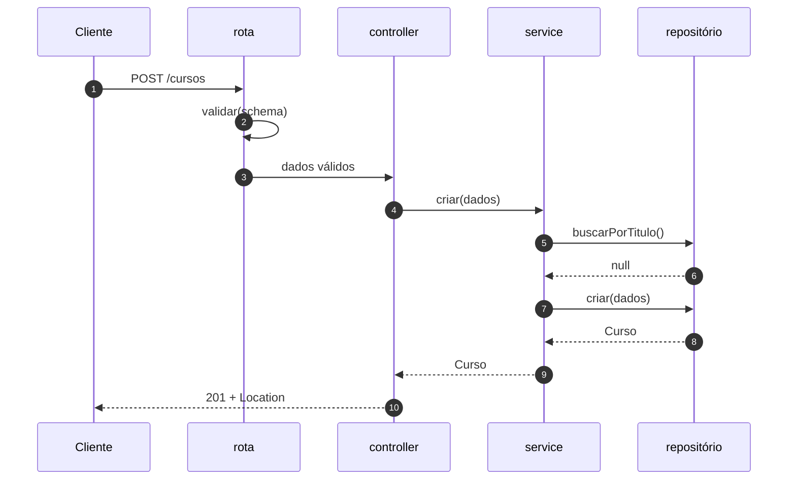

# 08.2 — Cada camada, uma de cada vez

**Em uma frase:** rota diz o endereço, controller traduz HTTP, service decide a
regra, repositório guarda — e o domínio dá nome às coisas que todos eles usam.

[← Parte 1 — O problema](./01-o-problema.md) · [Índice](./README.md) ·
[Parte 3 — A direção das dependências →](./03-direcao-das-dependencias.md)

<!-- sumario:inicio -->

**Sumário**

- [Uma imagem para segurar antes do código](#uma-imagem-para-segurar-antes-do-código)
- [Rota: o endereço](#rota-o-endereço)
- [Controller: o tradutor de HTTP](#controller-o-tradutor-de-http)
- [Service: onde a regra mora](#service-onde-a-regra-mora)
- [Repositório: guardar e buscar](#repositório-guardar-e-buscar)
- [Domínio: os nomes que todos usam](#domínio-os-nomes-que-todos-usam)
- [Onde fica a validação de formato](#onde-fica-a-validação-de-formato)
- [DTO: o objeto que atravessa a fronteira](#dto-o-objeto-que-atravessa-a-fronteira)
- [O que vai em cada camada, na dúvida](#o-que-vai-em-cada-camada-na-dúvida)
- [O caminho inteiro de uma requisição](#o-caminho-inteiro-de-uma-requisição)
- [Na prática](#na-prática)

<!-- sumario:fim -->

## Uma imagem para segurar antes do código

Pense num restaurante. O **cardápio** diz o que dá para pedir. O **garçom** anota
o pedido na língua do cliente e leva o prato — mas não cozinha. A **cozinha**
segue as receitas e decide o que pode ou não sair ("esse prato acabou", "sem
glúten não dá"). A **despensa** guarda os ingredientes e não opina sobre receita.

Cada um tem um assunto só, e se o garçom resolver cozinhar, o restaurante até
funciona — até o dia em que dois garçons cozinham o mesmo prato de jeitos
diferentes. Foi exatamente o que aconteceu na [parte 1](./01-o-problema.md).

No código, os papéis ficam assim, e esta parte passa por cada um:

| No restaurante                     | No código   | Pasta do exemplo principal |
| ---------------------------------- | ----------- | -------------------------- |
| cardápio                           | rota        | `rotas/`                   |
| garçom                             | controller  | `controllers/`             |
| cozinha                            | service     | `servicos/`                |
| despensa                           | repositório | `repositorios/`            |
| os nomes dos pratos e ingredientes | domínio     | `dominio/`                 |

Todo o código desta parte vem de
[`src/exemplos/06-10/08-camadas/`](../../../src/exemplos/06-10/08-camadas/) — o
exemplo que mostra **o que o repositório usa**.

## Rota: o endereço

**O problema.** Com tudo na rota, a única forma de saber "que endpoints esta API
tem?" é ler todos os handlers, porque URL e lógica estão misturadas.

**A mecânica.** O arquivo de rotas só liga caminho + método a quem sabe
responder, com a validação de formato no meio:

```ts
// rotas/cursos.ts
export function criarRotasCursos(servico: ServicoCursos): Router {
  const controller = criarControllerCursos(servico);
  const router = Router();

  router.get('/', validar(listarSchema, 'query'), controller.listar);
  router.post('/', validar(criarCursoSchema), controller.criar);
  router.get('/:id', validar(idSchema, 'params'), controller.buscar);
  router.patch(
    '/:id',
    validar(idSchema, 'params'),
    validar(alterarCursoSchema),
    controller.alterar,
  );
  router.delete('/:id', validar(idSchema, 'params'), controller.remover);
  router.post('/:id/publicar', validar(idSchema, 'params'), controller.publicar);

  return router;
}
```

Leia de cima para baixo e você tem a API inteira em vinte segundos. Repare que a
função **recebe** o service em vez de importá-lo — isso tem nome e motivo, e é o
assunto da [parte 4](./04-injecao-e-montagem.md).

**O princípio.** A rota não decide nada: ela liga um endereço a quem sabe
responder.

**O sinal de alerta.** Um `if` num arquivo de rotas quase sempre é regra ou
tradução que escorregou de camada.

## Controller: o tradutor de HTTP

**O problema.** Alguém precisa ler `req`, escolher o status code e montar a
resposta. Se for o service, a regra de negócio passa a depender de existir HTTP —
e um script de linha de comando, que não tem `req` nem `res`, não consegue usá-la.

**A mecânica.** Cada método do controller faz três coisas: ler o que chegou,
chamar **um** método do service, escrever a resposta.

```ts
// controllers/cursos.ts
async criar(_req: Request, res: Response) {
  const curso = await servico.criar(validados(res, criarCursoSchema));
  // O status é decisão de HTTP, então é aqui — não no service.
  res.status(201).location(`/cursos/${curso.id}`).json(curso);
},

async publicar(_req: Request, res: Response) {
  const { id } = validados(res, idSchema, 'params');
  res.json(await servico.publicar(id));
},
```

`validados` lê o dado que o middleware `validar` já conferiu e guardou em
`res.locals` — o porquê de não usar `req.body` direto está no
[módulo 07](../07-validacao-zod.md).

Não existe nenhum `try/catch` no arquivo. O service lança `AppError`, o Express 5
espera a Promise do handler e, se ela falhar, entrega o erro ao tratador central
do [módulo 06](../06-tratamento-de-erros.md). Um `try/catch` aqui só repetiria o
trabalho do tratador, pior e em seis lugares.

**O princípio.** O status code é uma decisão de HTTP, então só quem conhece HTTP
pode tomá-la.

**O sinal de alerta.** Controller com mais de 10 linhas por método quase sempre
está fazendo trabalho de service.

## Service: onde a regra mora

**O problema.** É o que a parte 1 mostrou: a regra de publicar precisava de um
endereço fora do handler.

**A mecânica.** O service é um objeto com um método por operação do negócio. Veja
o `publicar`, com a mesma regra que estava presa no handler:

```ts
// servicos/cursos.ts
async publicar(id: number): Promise<Curso> {
  const curso = await this.buscar(id); // lança 404 se não existir

  if (curso.publicado) throw conflito('Curso já está publicado');
  if (curso.horas < HORAS_MINIMAS_PARA_PUBLICAR) {
    throw requisicaoInvalida(
      `Curso precisa de ao menos ${HORAS_MINIMAS_PARA_PUBLICAR}h para ser publicado`,
    );
  }

  const atualizado = await repositorio.atualizar(id, { publicado: true });
  if (!atualizado) throw naoEncontrado('Curso', id);
  return atualizado;
},
```

Três coisas para observar:

1. **Nada de `req` ou `res`.** O método recebe um número e devolve um `Curso`.
   Uma rota, um teste ou um script podem chamá-lo do mesmo jeito.
2. **Nada de SQL ou de array.** Ele pede ao `repositorio` e não sabe como o dado
   é guardado.
3. **Ele lança erro em vez de devolver `null`.** "Curso ausente é 404" fica
   decidido num lugar só (`buscar`), em vez de cada chamador repetir o `if`.

Sobre o terceiro ponto, um detalhe honesto: `conflito()` cria um `AppError` que
carrega o **número** 409 dentro. Ou seja, o service não importa nada de HTTP, mas
ainda escolhe o status. É um atalho consciente, e a
[parte 9](./09-o-que-este-repo-usa.md) mostra o que ele economiza e o que custa.

**O princípio.** A regra de negócio mora num lugar que não sabe por onde foi
chamada.

**O sinal de alerta.** `import express` num arquivo de `servicos/`.

## Repositório: guardar e buscar

**O problema.** Com o array espalhado pelos handlers, trocar o array por SQLite
significa mexer em todos eles.

**A mecânica.** O repositório é o **único** lugar que sabe como os cursos são
guardados. Nesta versão, num array fechado dentro de uma função:

```ts
// repositorios/cursos-memoria.ts
export function criarRepositorioEmMemoria(iniciais: Curso[] = []): RepositorioCursos {
  // Estado encapsulado: quem recebe o repositório não tem acesso ao array.
  const cursos: Curso[] = [...iniciais];
  let proximoId = Math.max(0, ...cursos.map((c) => c.id)) + 1;

  return {
    async buscarPorTitulo(titulo: string) {
      const alvo = titulo.trim().toLowerCase();
      const curso = cursos.find((c) => c.titulo.toLowerCase() === alvo);
      return curso ? { ...curso } : null; // devolve CÓPIA
    },
    // ...listar, buscarPorId, criar, atualizar, remover
  };
}
```

O array fica numa variável local da função (um _closure_ — a função devolvida
continua enxergando a variável, e ninguém de fora enxerga). Sem isso, um handler
distraído faria `cursos.push()` direto e pularia todas as regras do service.

E os métodos devolvem **cópias** (`{ ...curso }`). Se devolvessem o objeto que
está dentro do array, quem recebeu poderia alterá-lo, e o "banco" mudaria sem
passar por lugar nenhum.

Repare na divisão de trabalho com o service. "Não pode haver dois cursos com o
mesmo título" é regra — mora no service. O repositório só sabe responder à
pergunta `buscarPorTitulo`; ele não sabe **por que** alguém quer saber.

**O princípio.** Quem guarda não decide.

**O sinal de alerta.** Um `if` de negócio dentro do repositório. A regra passa a
existir em dois lugares, e o dia em que os dois discordarem é o dia do bug da
parte 1.

### A pegadinha do update

O jeito óbvio de atualizar um curso é espalhar os dados novos por cima dos
antigos. O TypeScript deste repositório **recusa** isso, e é bom que recuse:

```ts
const atualizado = { ...atual, ...dados }; // ❌ não compila
```

> **Cuidado:** se `dados` é `{ titulo: undefined }` — chave presente, valor
> ausente —, o spread grava `undefined` por cima do título salvo e **apaga** o
> dado. A opção `exactOptionalPropertyTypes` do nosso `tsconfig` recusa esse
> código na compilação. Sem ela, compilaria, e o bug apareceria em produção como
> "às vezes o PATCH limpa o campo".

A saída é copiar só o que está definido:

```ts
const atualizado: Curso = { ...atual, id: atual.id };
if (dados.titulo !== undefined) atualizado.titulo = dados.titulo;
if (dados.horas !== undefined) atualizado.horas = dados.horas;
if (dados.publicado !== undefined) atualizado.publicado = dados.publicado;
```

Pelo mesmo motivo, os tipos do domínio declaram `titulo?: string | undefined`
explicitamente: é o formato que o Zod produz para campos opcionais, e sem o
`| undefined` o resultado do Zod não encaixa no tipo.

## Domínio: os nomes que todos usam

**O problema.** Rota, controller, service e repositório falam de "curso", "novo
curso", "filtro". Se cada um definir o próprio tipo, eles divergem. E se o tipo
morar dentro de uma das camadas, as outras precisam importar aquela camada.

**A mecânica.** Os tipos ficam num arquivo que **não importa nada**:

```ts
// dominio/curso.ts — nenhum import
export type Curso = { id: number; titulo: string; horas: number; publicado: boolean };

/** O que se pode criar: sem `id` (é do banco) e sem `publicado` (é regra). */
export type NovoCurso = { titulo: string; horas: number };

export type RepositorioCursos = {
  listar(filtro: FiltroCursos): Promise<Curso[]>;
  buscarPorId(id: number): Promise<Curso | null>;
  buscarPorTitulo(titulo: string): Promise<Curso | null>;
  criar(dados: NovoCurso): Promise<Curso>;
  atualizar(id: number, dados: AtualizacaoCurso): Promise<Curso | null>;
  remover(id: number): Promise<boolean>;
};
```

O último tipo é o mais importante do módulo inteiro. Ele é a **lista de coisas
que o service precisa que alguém saiba fazer**, e mora aqui, não em
`repositorios/`. Por que isso importa é o assunto da
[parte 3](./03-direcao-das-dependencias.md).

**O princípio.** As palavras do sistema pertencem a todas as camadas, então não
podem depender de nenhuma.

## Onde fica a validação de formato

O schema Zod não é uma camada nova. Ele fica **junto das rotas**
(`rotas/schemas.ts`) porque descreve o contrato HTTP: o que o cliente pode mandar
no corpo e na URL.

A divisão com o service é a que o [módulo 07](../07-validacao-zod.md) já
apresentou. **Formato** — é número? tem 3 caracteres? — o schema resolve olhando
só o dado que chegou. **Regra** — já existe outro curso com esse título? — precisa
consultar outros dados, então é do service.

## DTO: o objeto que atravessa a fronteira

Repare que `NovoCurso` não é `Curso`. O objeto que entra na API não precisa ter o
mesmo formato do que está guardado.

Esse objeto de entrada (ou de saída) tem nome: **DTO**, _Data Transfer Object_ —
um tipo que existe só para carregar dados de uma camada para outra, sem
comportamento.

```ts
type Curso = { id; titulo; horas; publicado }; // o que está guardado
type NovoCurso = { titulo; horas }; // o que o cliente manda
```

Não ter `publicado` na criação **é** a segurança. O cliente não consegue criar um
curso já publicado, pulando as condições do `publicar`. É a mesma ideia do
`.strict()` do [módulo 07](../07-validacao-zod.md), que recusa campo a mais.

O custo é manter dois tipos parecidos. Compensa quando o formato externo
**precisa** ser diferente do interno — campo que o cliente não pode mandar, campo
interno que não pode sair. Quando os dois são iguais e vão continuar iguais, um
tipo só basta.

## O que vai em cada camada, na dúvida

Com as cinco peças vistas, dá para decidir a camada de um trecho de código pela
pergunta que ele responde:

| A pergunta que o código responde    | Camada      |
| ----------------------------------- | ----------- |
| "Qual URL?"                         | Rota        |
| "O formato do body é válido?"       | Schema (07) |
| "Qual status code? 201 ou 200?"     | Controller  |
| "Pode publicar um curso de 1 hora?" | Service     |
| "Título repetido é conflito?"       | Service     |
| "Como isso vira SQL?"               | Repositório |
| "Que campos um curso tem?"          | Domínio     |

## O caminho inteiro de uma requisição

Agora que cada peça tem nome, este é o trajeto de um `POST /cursos` passando por
todas:



E o resumo do que cada camada conhece — e, principalmente, do que ela **não**
conhece:

| Camada          | Responsabilidade                   | Conhece              | **Não** conhece |
| --------------- | ---------------------------------- | -------------------- | --------------- |
| **Rota**        | Mapear caminho+método → controller | Express, controller  | regra, banco    |
| **Controller**  | Traduzir HTTP ↔ service            | `req`/`res`, status  | regra, banco    |
| **Service**     | **Regras de negócio**              | domínio, repositório | HTTP, SQL       |
| **Repositório** | Guardar e buscar                   | banco                | regra, HTTP     |
| **Domínio**     | Dar nome às coisas                 | nada                 | tudo o resto    |

## Na prática

```bash
node src/exemplos/06-10/08-camadas/servidor.ts
```

```bash
B=localhost:5056/api/v1/cursos
curl "$B?publicado=true"
curl -X POST $B -H 'Content-Type: application/json' -d '{"titulo":"Camadas","horas":5}'
curl -X POST $B -H 'Content-Type: application/json' -d '{"titulo":"Camadas","horas":5}'
curl -X POST $B/2/publicar
curl -X POST $B/2/publicar
curl -X POST $B/3/publicar
curl -X DELETE $B/2
```

A saída, na ordem (o `requestId` muda a cada execução):

```text
[{"id":1,"titulo":"Fundamentos de HTTP","horas":4,"publicado":true}]
{"id":4,"titulo":"Camadas","horas":5,"publicado":false}                          ← 201
{"erro":"Já existe um curso chamado \"Camadas\"","status":409,"requestId":"…"}    ← regra do service
{"id":2,"titulo":"Express do zero","horas":8,"publicado":true}                   ← publicou
{"erro":"Curso já está publicado","status":409,"requestId":"…"}
{"erro":"Curso precisa de ao menos 2h para ser publicado","status":400,"requestId":"…"}
{"erro":"Curso publicado não pode ser removido. Despublique primeiro.","status":409,"requestId":"…"}
```

Todo erro sai no mesmo formato `{ erro, status, requestId }`, sem nenhum
`res.status(...).json(...)` de erro escrito nos controllers: é o tratador central
do [módulo 06](../06-tratamento-de-erros.md) trabalhando.

Agora abra os arquivos e confira o que cada um importa. É a tabela de cima,
verificável:

| Arquivo                          | Importa                    |
| -------------------------------- | -------------------------- |
| `dominio/curso.ts`               | **nada**                   |
| `servicos/cursos.ts`             | domínio + `AppError`       |
| `repositorios/cursos-memoria.ts` | domínio                    |
| `controllers/cursos.ts`          | tipos do Express + service |
| `servidor.ts`                    | todos                      |

---

[← Parte 1 — O problema](./01-o-problema.md) · [Índice](./README.md) ·
[Parte 3 — A direção das dependências →](./03-direcao-das-dependencias.md)
