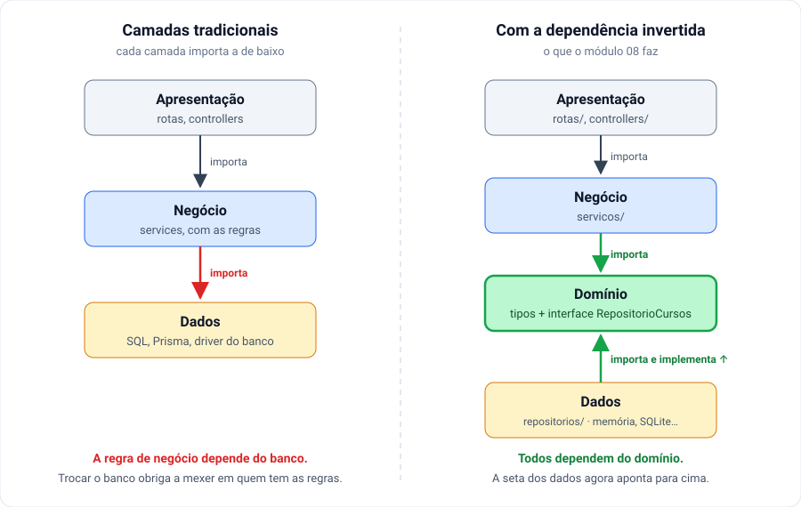

# 08.3 — A direção das dependências

**Em uma frase:** o que muda pouco não pode depender do que muda muito — e é por
isso que o service depende de um tipo do domínio, e não do banco.

[← Parte 2 — Cada camada](./02-cada-camada.md) · [Índice](./README.md) ·
[Parte 4 — Injeção e montagem →](./04-injecao-e-montagem.md)

<!-- sumario:inicio -->

**Sumário**

- [O que "depender" quer dizer aqui](#o-que-depender-quer-dizer-aqui)
- [Nem tudo muda na mesma velocidade](#nem-tudo-muda-na-mesma-velocidade)
- [A seta para o lado errado](#a-seta-para-o-lado-errado)
- [A seta invertida](#a-seta-invertida)
- [Por que o nome é "inversão de dependência"](#por-que-o-nome-é-inversão-de-dependência)
- [O princípio](#o-princípio)
- [O contrato do repositório, olhado de perto](#o-contrato-do-repositório-olhado-de-perto)
- [O custo](#o-custo)
- [O que isso muda no seu código](#o-que-isso-muda-no-seu-código)

<!-- sumario:fim -->

## O que "depender" quer dizer aqui

Um arquivo **depende** de outro quando tem um `import` dele. A consequência
prática é uma só: se o arquivo importado mudar — de nome, de assinatura, de
comportamento —, quem importa pode quebrar.

Então a pergunta "quem depende de quem?" é a mesma que "quando eu mexer aqui, o
que mais vou ter que mexer?". Essa é a pergunta que esta parte inteira responde.

## Nem tudo muda na mesma velocidade

Ordene as peças de um sistema por uma pergunta só: **com que frequência isto
muda?**

| Muda...         | Peça                                  | Quando muda              |
| --------------- | ------------------------------------- | ------------------------ |
| Muito           | Framework, driver de banco, ORM       | você troca de ferramenta |
| Às vezes        | Rota, controller, formato de resposta | a API evolui             |
| **Quase nunca** | **Regra de negócio, domínio**         | o **negócio** muda       |

"Curso de 1 hora não pode ser publicado" continua verdade com Express ou com
Fastify, com SQLite ou com Postgres, e até dentro de um script de linha de comando
que não tem servidor nenhum. A regra é da escola, não da ferramenta.

## A seta para o lado errado

Agora imagine o service escrito do jeito que parece natural, importando o banco
direto:

```ts
// ❌ servicos/cursos.ts dependendo da ferramenta
import { prisma } from '../db.ts';

export async function publicar(id: number) {
  const curso = await prisma.curso.findUnique({ where: { id } });
  if (curso.horas < 2) throw requisicaoInvalida('...');
  return prisma.curso.update({ where: { id }, data: { publicado: true } });
}
```

A regra está no service, como a parte 2 pediu. Mas o arquivo que contém a regra
tem um `import` do Prisma. No dia em que o Prisma mudar — versão nova, API
diferente, ou a decisão de trocar de ORM —, o arquivo da regra precisa ser mexido
junto.

O que quase nunca muda virou refém do que muda toda hora. Esse é o desenho das
**camadas tradicionais**: cada camada importa a de baixo, e a de baixo é o banco.

## A seta invertida

A saída é o service **não importar o banco**. Em vez disso, ele depende de um
tipo que descreve o que precisa — e esse tipo mora do lado estável, no domínio:

```ts
// dominio/curso.ts — nenhum import
export type RepositorioCursos = {
  buscarPorId(id: number): Promise<Curso | null>;
  atualizar(id: number, dados: AtualizacaoCurso): Promise<Curso | null>;
  // ...
};
```

```ts
// servicos/cursos.ts — importa só o domínio
import type { RepositorioCursos } from '../dominio/curso.ts';
```

```ts
// repositorios/cursos-memoria.ts — também importa o domínio
import type { RepositorioCursos } from '../dominio/curso.ts';

export function criarRepositorioEmMemoria(...): RepositorioCursos { ... }
```

Olhe os três `import`: **todos apontam para `dominio/`**. O service não conhece o
repositório de memória, e o repositório de memória não conhece o service. Os dois
conhecem só o contrato do meio.

Lado a lado com as camadas tradicionais:



Na esquerda, a seta vermelha é o problema: o negócio depende do banco. Na
direita, a camada de dados continua existindo, mas a seta dela aponta **para
dentro** — ela se encaixa num contrato que o domínio escreveu.

## Por que o nome é "inversão de dependência"

Repare no sentido das coisas. Na hora de rodar, o service **chama** o
repositório: a execução vai do service para o banco. Mas no código-fonte, o
repositório é que **depende** de um tipo que mora ao lado do service. A seta do
`import` aponta ao contrário da seta da execução.

É isso que foi invertido, e daí o nome: **inversão de dependência**. Não tem
mais nada escondido no termo.

## O princípio

A regra que resume esta parte, e a única que vale decorar no módulo: **quem é
mais estável não pode depender de quem muda mais.**

E tem um teste rápido para o seu código: se um arquivo de `servicos/` importa
`express`, `prisma` ou qualquer coisa de `repositorios/`, alguma seta está
apontando para fora.

> **Nota:** a prova de que funciona não é teórica neste repositório. Rode
>
> ```bash
> diff -rq exercicios/06-10/08-camadas/solucao/servicos exercicios/06-10/10-prisma/solucao/servicos
> ```
>
> Entre a solução com array em memória (módulo 08) e a com Prisma (módulo 10), os
> services são **idênticos**. O `diff` não imprime nada.

## O contrato do repositório, olhado de perto

O tipo `RepositorioCursos` tem dois detalhes que parecem pequenos e não são:

1. **Todos os métodos devolvem `Promise`, mesmo na versão em memória**, que
   poderia devolver o valor na hora. A interface tem que servir ao banco de
   verdade, que é assíncrono. Se ela fosse síncrona agora, trocar por SQLite no
   [módulo 09](../09-sqlite-e-sql.md) mudaria a assinatura — e o service inteiro
   junto, que é exatamente o que a seta invertida queria evitar.

2. **A interface fala a língua do domínio.** `buscarPorTitulo`, não `findBySQL`.
   Retorna `Curso`, não uma "linha do banco" com os nomes de coluna. Uma interface
   que menciona SQL obrigaria o service a saber SQL — a seta voltaria a apontar
   para fora, só que escondida dentro de um tipo.

Um teste para quando você escrever o seu: "este método faz sentido para um array,
para SQLite **e** para Prisma?" `buscarPorId` sim. `filtrarComArrayFilter` não.

## O custo

A seta invertida custa um tipo a mais para manter e um nível de indireção: para
saber o que `repositorio.buscarPorId` faz de verdade, você precisa descobrir qual
implementação foi passada — o editor não te leva direto ao código com um clique.

Ela compensa quando existe, ou vai existir, **mais de uma implementação**: o
banco de produção e um em memória para o teste ([módulo 12](../../11-15/12-testes.md)),
ou o array hoje e o SQLite amanhã. Quando o banco é definitivo e você não testa o
service isolado, a interface é cerimônia — a [parte 5](./05-quando-nao-usar.md)
volta nisso.

## O que isso muda no seu código

Duas consequências práticas, que o resto do módulo e do curso usam o tempo todo:

- O service passa a **receber** o repositório de algum lugar, em vez de
  importá-lo. De onde, e quem decide qual, é a [parte 4](./04-injecao-e-montagem.md).
- Trocar o banco vira escrever um arquivo novo em `repositorios/` que satisfaça o
  mesmo tipo. É o que os módulos [09](../09-sqlite-e-sql.md) e
  [10](../10-prisma-orm.md) fazem, sem tocar no service.

---

[← Parte 2 — Cada camada](./02-cada-camada.md) · [Índice](./README.md) ·
[Parte 4 — Injeção e montagem →](./04-injecao-e-montagem.md)
