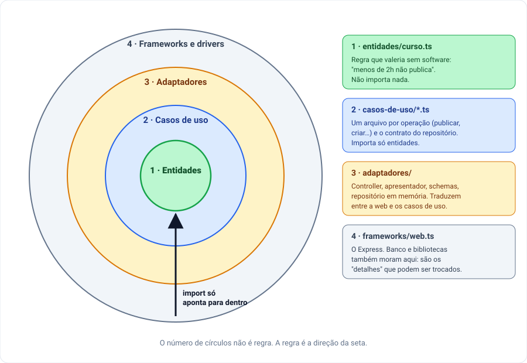

# 08.7 — Clean Architecture e Onion

**Em uma frase:** a mesma regra da seta para dentro, desenhada como círculos —
com as regras separadas em duas camadas, as que valeriam sem software e as
operações da aplicação.

[← Parte 6 — Arquitetura hexagonal](./06-hexagonal.md) · [Índice](./README.md) ·
[Parte 8 — DDD →](./08-ddd.md)

<!-- sumario:inicio -->

**Sumário**

- [De onde vem](#de-onde-vem)
- [A mecânica: quatro círculos](#a-mecânica-quatro-círculos)
- [O desenho](#o-desenho)
- [A prova: o mesmo publicar-todos](#a-prova-o-mesmo-publicar-todos)
- [Onion, em um parágrafo](#onion-em-um-parágrafo)
- [O custo](#o-custo)
- [Uma ideia a mais: a pasta de cima deveria dizer o assunto](#uma-ideia-a-mais-a-pasta-de-cima-deveria-dizer-o-assunto)
- [O princípio](#o-princípio)
- [O que isso muda no seu código](#o-que-isso-muda-no-seu-código)

<!-- sumario:fim -->

## De onde vem

Em 2012, Robert C. Martin (o "Uncle Bob") publicou um texto curto chamado _The
Clean Architecture_. Ele não inventou uma arquitetura nova: juntou a Hexagonal da
[parte 6](./06-hexagonal.md), a Onion e outras três propostas, e mostrou que
todas diziam a mesma coisa com desenhos diferentes.

O que elas têm em comum, segundo o texto, é produzir sistemas que não dependem
do framework, da interface, do banco nem de nenhum serviço externo — e que por
isso podem ser testados sem nenhum deles.

E a regra que junta tudo é a que você já viu na
[parte 3](./03-direcao-das-dependencias.md). Na versão dele: **dependências de
código-fonte só podem apontar para dentro.** Nada num círculo de dentro pode
saber qualquer coisa de um círculo de fora.

## A mecânica: quatro círculos

O exemplo desta parte é
[`src/exemplos/06-10/08-arquiteturas/03-clean/`](../../../src/exemplos/06-10/08-arquiteturas/03-clean/),
com uma pasta por círculo. Vá de dentro para fora.

### Círculo 1 — Entidades: a regra que valeria sem software

"Curso com menos de 2 horas não pode ser publicado" é regra da **escola**, não do
sistema. Se a escola anotasse os cursos num caderno, ela continuaria valendo. É
isso que a põe no centro: é a última coisa que deveria mudar quando a tecnologia
muda.

```ts
// entidades/curso.ts — nenhum import
export type Recusa = { tipo: 'conflito' | 'regra-violada'; motivo: string };

export function motivoParaNaoPublicar(curso: Curso): Recusa | null {
  if (curso.publicado) return { tipo: 'conflito', motivo: 'Curso já está publicado' };
  if (curso.horas < HORAS_MINIMAS_PARA_PUBLICAR) {
    return { tipo: 'regra-violada', motivo: `Curso precisa de ao menos 2h ...` };
  }
  return null;
}
```

Repare que a função **devolve** a recusa em vez de lançar erro. O motivo aparece
logo adiante: dois casos de uso a consultam, e cada um reage de um jeito.

### Círculo 2 — Casos de uso: as operações da aplicação

Um **caso de uso** é uma operação que o sistema oferece — publicar um curso,
criar um curso. Na Clean, cada um vira um arquivo:

```text
casos-de-uso/
├── portas.ts               o contrato do repositório (a Clean chama de "gateway")
├── erros.ts
├── listar-cursos.ts
├── buscar-curso.ts
├── criar-curso.ts
├── publicar-curso.ts
├── publicar-rascunhos.ts
└── remover-curso.ts
```

O caso de uso conta a história da operação — buscar, perguntar à entidade, gravar
—, mas a regra em si não está escrita nele:

```ts
// casos-de-uso/publicar-curso.ts
export function publicarCurso(repositorio: RepositorioCursos): PublicarCurso {
  return async (id) => {
    const curso = await repositorio.buscarPorId(id);
    if (!curso) throw cursoNaoEncontrado(id);

    const recusa = motivoParaNaoPublicar(curso); // ← a regra é da entidade
    if (recusa) throw recusado(recusa);

    const publicado = { ...curso, publicado: true };
    await repositorio.salvar(publicado);
    return publicado;
  };
}
```

A divisão entre os dois círculos responde a uma pergunta que o exemplo principal
não fazia: **esta regra é do negócio, ou é desta aplicação?** "Menos de 2h não
publica" é do negócio. "Título não se repete" precisa olhar **outros** cursos —
uma entidade só enxerga a si mesma —, então fica no caso de uso `criar-curso.ts`.

### Círculo 3 — Adaptadores: os tradutores

Controller, schemas, repositório em memória e um papel novo, o **apresentador**
(_presenter_): quem transforma o que o caso de uso devolve no formato que a API
promete ao cliente.

```ts
// adaptadores/apresentador.ts
export const apresentarCurso = (curso: Curso): CursoApresentado => ({
  id: curso.id,
  titulo: curso.titulo,
  horas: curso.horas,
  publicado: curso.publicado,
});
```

Hoje ele copia campo a campo, e é honesto dizer que é burocracia. O dia em que se
paga: a API precisa de uma versão 2 que mostre `"8h"` em vez de `8`. A mudança
fica aqui, e nenhum caso de uso é tocado.

### Círculo 4 — Frameworks e drivers: os detalhes

O Express, o driver do banco, as bibliotecas. O texto original chama esse círculo
de "onde os detalhes ficam", e a palavra é proposital: **detalhe** é aquilo que
não deveria decidir a forma do resto. No exemplo, é só
[`frameworks/web.ts`](../../../src/exemplos/06-10/08-arquiteturas/03-clean/frameworks/web.ts),
que cola URL + validação no método do controller.

## O desenho



O próprio texto avisa que os quatro círculos são um esquema, não uma lei: pode
haver mais ou menos. O que não muda é a direção da seta.

## A prova: o mesmo publicar-todos

A [parte 1](./01-o-problema.md) terminou com um bug: o botão "publicar todos",
copiado de dentro de um handler, publicou um curso de 1 hora. Aqui o mesmo pedido
virou um caso de uso que **chama** a regra em vez de copiá-la:

```ts
// casos-de-uso/publicar-rascunhos.ts
for (const curso of await repositorio.listar({ publicado: false })) {
  const recusa = motivoParaNaoPublicar(curso); // a mesma função do publicar-curso
  if (recusa) {
    resultado.recusados.push({ id: curso.id, motivo: recusa.motivo });
    continue;
  }
  // ...grava e acrescenta em `publicados`
}
```

É por isso que a entidade devolve a recusa em vez de lançar: `publicar-curso`
transforma a recusa em erro, e `publicar-rascunhos` só pula aquele curso e segue.
Com uma função que lança, o segundo precisaria de um `try/catch` por curso.

Rode os dois exemplos lado a lado:

```bash
node src/exemplos/06-10/08-arquiteturas/01-tudo-na-rota/servidor.ts &
node src/exemplos/06-10/08-arquiteturas/03-clean/servidor.ts &
curl -X POST localhost:5081/api/v1/cursos/publicar-todos
curl -X POST localhost:5083/api/v1/cursos/publicar-todos
```

```text
{"publicados":2,"cursos":[{"id":2,...},{"id":3,"titulo":"Curso relâmpago","horas":1,"publicado":true}]}
{"publicados":[{"id":2,"titulo":"Express do zero","horas":8,"publicado":true}],"recusados":[{"id":3,"motivo":"Curso precisa de ao menos 2h para ser publicado"}]}
```

Mesmo pedido, mesmos dados. Na primeira, a regra tinha duas cópias e elas
discordaram. Na segunda, a regra tem um endereço, e o curso de 1 hora é recusado
com o motivo.

## Onion, em um parágrafo

Em 2008, Jeffrey Palermo descreveu a **Onion Architecture** (arquitetura em
cebola) com o mesmo diagnóstico: nas camadas tradicionais, a interface e as
regras acabam dependendo do acesso a dados, e o acesso a dados é o que mais muda.
A resposta dele é a mesma seta para dentro, com camadas chamadas _domain model_
no centro, _domain services_ e _application services_ em volta, e a
infraestrutura na casca. A frase que resume a Onion é dele: **o banco não é o
centro — ele é externo.**

As três arquiteturas, lado a lado, falando das mesmas peças:

| Peça                             | Hexagonal (parte 6)       | Clean                  | Onion                |
| -------------------------------- | ------------------------- | ---------------------- | -------------------- |
| Regra que valeria sem software   | núcleo                    | entidades              | domain model         |
| Operações da aplicação           | núcleo (porta de entrada) | casos de uso           | application services |
| Contrato do repositório          | porta de saída            | gateway (no círculo 2) | interface no núcleo  |
| Controller, repositório concreto | adaptadores               | adaptadores            | infraestrutura       |
| Express, banco                   | fora dos adaptadores      | frameworks e drivers   | infraestrutura       |

As colunas mudam os nomes e a quantidade de camadas. A seta é a mesma nas três.

## O custo

A Clean é a mais cara das três no dia a dia, e o exemplo deixa o preço à mostra:

- **Um arquivo por caso de uso.** Seis operações, seis arquivos, e seis linhas
  no `servidor.ts` onde o exemplo principal tem uma (`criarServicoCursos(repo)`).
  Num sistema real, vira facilmente dezenas de arquivos de oito linhas.
- **Casos de uso que só repassam.** O `listar-cursos.ts` existe porque o padrão
  pede, não porque acrescenta algo — o sinal de alerta da
  [parte 5](./05-quando-nao-usar.md).
- **Apresentador que copia campos.** Paga só se o formato da API for mudar
  independentemente do resto.

Ela se paga quando as operações são muitas e **diferentes entre si** — cada caso
de uso com a própria história, as próprias permissões, o próprio fluxo. Aí, um
arquivo por operação vira um índice do que o sistema faz.

## Uma ideia a mais: a pasta de cima deveria dizer o assunto

Em 2011, antes do texto dos círculos, Martin escreveu sobre _Screaming
Architecture_ (a arquitetura que "grita"). A ideia: a planta de uma casa mostra
cozinha, sala, quartos — você sabe que é uma casa antes de ler qualquer coisa. Da
mesma forma, abrir as pastas de um projeto deveria mostrar **do que ele trata**
(cursos, matrículas, pagamentos), e não com que ferramenta foi feito
(controllers, services, repositories).

Este repositório organiza por camada técnica: `controllers/`, `servicos/`,
`repositorios/`. Para um domínio só, com poucos arquivos, é o mais simples de
navegar. Martin Fowler faz a mesma observação sobre projetos grandes: quando o
sistema cresce, a divisão de cima deveria ser por assunto (`cursos/`,
`matriculas/`), e cada assunto teria as próprias camadas dentro. A
[parte 9](./09-o-que-este-repo-usa.md) volta nisso.

## O princípio

O que as três arquiteturas desta e da parte anterior têm em comum é uma frase só:
**a regra da seta é o que importa; o número de círculos é desenho.**

## O que isso muda no seu código

- Quando uma regra depende só do próprio objeto ("este curso pode ser
  publicado?"), ela pode ser uma função pura sobre ele, reusável por qualquer
  operação.
- Quando uma regra precisa olhar o conjunto ("outro curso usa este título?"),
  ela fica na operação, não no objeto.
- "Um arquivo por caso de uso" é uma compra como outra qualquer: faça quando as
  operações forem muitas e diferentes, não por padrão.

---

[← Parte 6 — Arquitetura hexagonal](./06-hexagonal.md) · [Índice](./README.md) ·
[Parte 8 — DDD →](./08-ddd.md)
