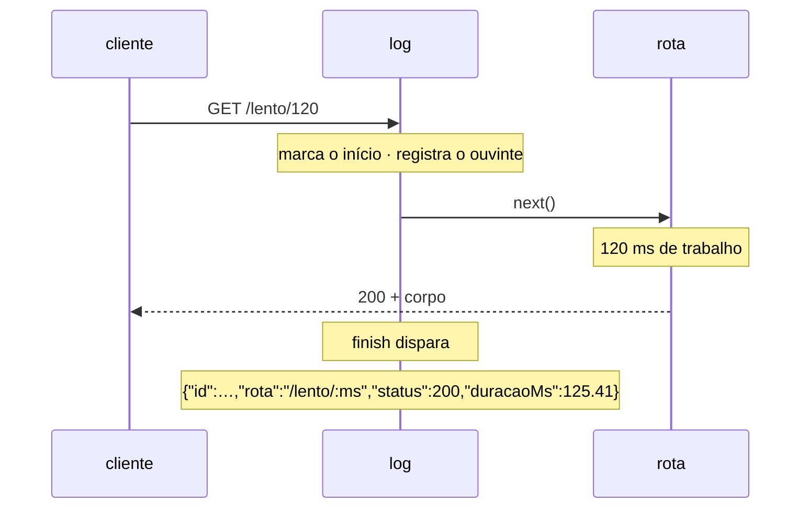

# Middleware — log

📦 módulo 05 · 🧩 grupo 01

Escreve uma linha JSON por requisição, com método, rota, caminho, status,
duração e o id da requisição.

## O problema

O `morgan` já está instalado neste repositório e já resolve metade disso. Ele
escreve assim:

```
GET /pedidos/8842 200 431 - 12.402 ms
```

Essa linha é ótima para o terminal aberto do lado enquanto você desenvolve. Ela é
inútil três semanas depois, quando alguém pergunta: **"o que aconteceu com a
requisição `abc-123` ontem às 3h?"** — ou "quantas vezes o `POST /pedidos`
respondeu 5xx nesta semana?", ou "o `/relatorios` está lento só para um cliente
ou para todo mundo?".

Nenhuma dessas perguntas se responde lendo. Todas se respondem **filtrando por
campo** — e para filtrar por campo, a linha precisa ter campos. É a diferença
entre uma frase e um objeto, e é o assunto do
[módulo 14](../../../docs/14-observabilidade.md), que troca o `morgan` por um
logger estruturado de verdade. Aqui, no módulo 05, a linha é escrita à mão para
que o mecanismo apareça: quem escreve os campos uma vez entende o que o logger
pronto está fazendo por baixo, e o que ele **não** faz.

O outro lado do problema é a razão de isto ser um middleware e não uma linha em
cada handler: a rota que ninguém lembrou de instrumentar é exatamente a que vai
falhar, e o 404 — que não tem handler nenhum — some por completo. O log é a coisa
que precisa acontecer em toda requisição sem pertencer a nenhuma rota, o caso do
[módulo 05](../../../docs/05-middlewares.md).

## Como funciona

O middleware não escreve nada quando roda. Ele marca o instante de entrada,
registra um ouvinte em `res.on('finish')` e chama `next()` imediatamente. A linha
sai depois, quando a resposta inteira já foi entregue.

Esse adiamento não é detalhe de implementação — é o que torna o log possível. Na
descida, metade dos campos ainda não existe: não há status (a rota nem rodou),
não há duração (ela é justamente o que se quer medir) e não se sabe sequer se
alguma rota vai casar. Em `finish`, os quatro campos que interessam já estão
decididos.



Repare em quem produz cada campo. O `id` não é gerado aqui: ele é lido de
`res.locals`, onde o [`id-de-requisicao`](../id-de-requisicao/README.md) o
deixou. A duração é medida de novo, com o mesmo relógio monotônico que o
[`tempo-de-resposta`](../tempo-de-resposta/README.md) usa — e a razão de não
reaproveitar a medida do vizinho está nas decisões, abaixo.

## O código

O arquivo completo está em [`middleware.ts`](./middleware.ts).

```ts
const CHAVE_ID = 'idDaRequisicao';

export function log(req: Request, res: Response, next: NextFunction) {
  const inicio = process.hrtime.bigint();

  // `finish` dispara quando o último byte da resposta foi entregue ao sistema
  // operacional. É tarde demais para mexer em cabeçalho (a pasta
  // `tempo-de-resposta` mostra o que acontece), e é exatamente por isso que ele
  // serve para log: aqui `res.statusCode` já é o status final, inclusive quando
  // quem decidiu o status foi o tratador de erro no fim da pilha.
  res.on('finish', () => {
    const duracaoMs = Number(process.hrtime.bigint() - inicio) / 1e6;
    const idValor: unknown = res.locals[CHAVE_ID];

    // `req.route.path` é o padrão registrado (`/lento/:ms`), não o caminho que
    // chegou (`/lento/120`). `req.route` é `undefined` quando nenhuma rota casou
    // (o 404), e aí o caminho cru é o único dado que existe.
    const rota: string = req.route?.path ?? req.path;

    // `req.originalUrl` traz a query string colada, e a query string é o lugar
    // clássico onde a credencial vaza: `?token=`, `?api_key=`, `?senha=`.
    const caminho: string = req.originalUrl.split('?')[0] ?? req.path;

    const linha = {
      hora: new Date().toISOString(),
      id: typeof idValor === 'string' ? idValor : 'sem-id',
      metodo: req.method,
      rota,
      caminho,
      status: res.statusCode,
      duracaoMs: Number(duracaoMs.toFixed(2)),
    };

    // `JSON.stringify` de uma linha só: a linha é a unidade que o coletor de log
    // lê. Um objeto quebrado em dez linhas indentadas vira dez eventos soltos, e
    // nenhum deles é JSON válido sozinho.
    console.log(JSON.stringify(linha));
  });

  next();
}
```

A chave `'idDaRequisicao'` aparece repetida aqui e no `id-de-requisicao` em vez
de ser importada de lá. É a regra do catálogo: cada pasta é copiável sozinha, e
um `import` para a pasta vizinha faria com que copiar esta trouxesse um caminho
quebrado. O custo é real e vale ser dito — se alguém renomear a chave num arquivo
e esquecer do outro, nada quebra: o log passa a sair com `"id":"sem-id"` em toda
linha, e ninguém percebe até precisar do log.

### `rota` **e** `caminho`, os dois

O par é a decisão menos óbvia do arquivo e a que mais rende.

`rota` é o padrão que você registrou (`/lento/:ms`, `/pedidos/:id`). Ele é o
mesmo para as dez mil requisições que atingem aquele endpoint, e é por isso que
serve para **contar**: "quantos 500 em `/pedidos/:id` hoje", "qual a duração
mediana de `/relatorios`". Se você agrupar pelo caminho cru, cada id de recurso
vira uma série própria: `/pedidos/1`, `/pedidos/2`, `/pedidos/3`… mil pedidos
viram mil "rotas", e qualquer contagem por rota deixa de significar coisa alguma.
Isso vira métrica no [módulo 14](../../../docs/14-observabilidade.md).

`caminho` é o valor real (`/lento/120`). Ele não serve para agrupar, e serve para
o caso individual: quando você já achou a requisição pelo `id` e quer saber
**qual** pedido era. Sem ele, você sabe que houve um 500 em `/pedidos/:id` e não
sabe em qual pedido — que é justamente a informação que faz reproduzir o bug.

Ou seja: um responde "como está o endpoint", o outro responde "o que aconteceu
neste caso". São as duas perguntas diferentes da tabela do módulo 14, e cada
campo atende uma.

### O que nunca entra na linha

`Authorization`, `Cookie`, `Set-Cookie` e `req.body` estão **deliberadamente**
fora, e isso é decisão, não esquecimento.

A razão está no destino do arquivo. O banco de dados tem senha forte, acesso
restrito e auditoria; o log não tem nada disso — ele é copiado para um agregador,
fica visível para o time inteiro, é retido por meses "para o caso de precisar" e
quase nunca é criptografado. Um token que caiu no log continua válido em backups
que ninguém lembra que existem. O
[módulo 14](../../../docs/14-observabilidade.md) tem a lista completa e a
configuração de redação que automatiza isso.

`req.body` fica de fora inteiro, e não filtrado: é por onde passam a senha do
cadastro e o número do cartão. `body: req.body` é a linha que vaza a senha de
todo mundo de uma vez, e ela nunca parece perigosa — ela parece útil. Se um dia
precisar do corpo, escolha campo por campo o que entra.

**E é por isso que `caminho` é cortado no `?`.** Este é o vazamento que a lista
de cabeçalhos não pega: `req.originalUrl` traz a query string colada, e a query
string é onde a credencial aparece sem ninguém convidar — `?token=`, `?api_key=`,
`?reset=`. Quem escreve `caminho: req.originalUrl` está seguindo todas as regras
acima e mesmo assim gravando o token em texto puro, por uma porta que não está na
lista. O corte no `?` descarta os filtros junto, e esse é o preço: se um dia você
precisar saber que a busca foi `?status=pendente`, escolha as chaves uma a uma,
como no corpo.

## Como usar

```ts
app.use(tempoDeResposta);
app.use(idDeRequisicao); // precisa vir antes: o log lê o id que ele deixou
app.use(log);
// ... rotas
app.use(quatroCentosEQuatro);
```

Duas posições importam, por motivos opostos.

**Depois do `id-de-requisicao`**, porque o log lê `res.locals`. Inverter os dois
não dá erro: `res.locals[CHAVE_ID]` é `undefined`, o acessor devolve `'sem-id'`,
e a API continua funcionando perfeitamente com um log inutilizável. É o tipo de
defeito que só aparece no dia em que alguém precisa costurar as linhas de uma
requisição, e aí já é tarde.

**Acima das rotas**, porque o ouvinte precisa estar registrado antes de a
resposta terminar. Montado depois de todas as rotas, ele nunca chega a rodar para
as requisições que uma rota atendeu — o `next()` da última rota não desce até
ele — e o log passa a ter só os 404. Um log parcial é pior que log nenhum: ele
parece completo.

A posição relativa ao `tempo-de-resposta` é indiferente ao log, e a demo os põe
nessa ordem por outro motivo — o `tempoDeResposta` mede o que vem depois dele, e
querer que ele meça o log também é o que o coloca em primeiro.

## As decisões e o porquê

### `console.log` e não um logger de verdade

Este middleware existe no módulo 05, e o módulo 05 é sobre o mecanismo do
middleware. Trazer o `pino` aqui resolveria níveis, redação automática, saída
assíncrona e serialização de erro — e esconderia justamente a parte que se quer
ver, que é o `finish`, os campos e o momento em que cada um fica pronto.

O custo é honesto e precisa ser dito, porque `console.log` em produção tem
defeitos concretos: ele é **síncrono** quando a saída é arquivo ou pipe (o
processo para de atender requisições enquanto escreve), não tem nível — não há
como calar as linhas de `info` sem apagar código — e cada `JSON.stringify` é
feito na thread principal. O [módulo 14](../../../docs/14-observabilidade.md)
troca os três.

### Uma linha no fim, não uma no começo e outra no fim

A alternativa é logar a chegada (`--> GET /pedidos`) e a saída
(`<-- GET /pedidos 200`). Ela tem uma vantagem real: a requisição que **nunca
termina** — porque o processo caiu, porque o handler pendurou — aparece no log
como uma linha de chegada sem par, e no formato de uma linha só ela simplesmente
não existe.

O custo da alternativa é dobrar o volume, e volume de log é custo direto: o
agregador cobra por gigabyte ingerido. Como metade dos campos que interessam
(status, duração) só existe no fim, a linha de chegada seria quase toda
redundante. A escolha aqui é a linha única; se o desaparecimento silencioso
incomodar, o lugar de resolvê-lo é um `res.on('close')`, que dispara quando o
cliente desiste antes do fim.

### Medir a duração de novo, em vez de reaproveitar o `X-Tempo-ms`

Ler o cabeçalho que o [`tempo-de-resposta`](../tempo-de-resposta/README.md)
carimbou economizaria três linhas. Custaria a independência: o log passaria a só
funcionar quando o outro middleware estivesse montado, montado **antes**, e com o
mesmo nome de cabeçalho — três amarras invisíveis, sendo que quebrar qualquer uma
delas produz `duracaoMs: NaN` em vez de erro.

As duas medidas são diferentes de propósito e a diferença é informação: o
`X-Tempo-ms` conta a partir do primeiro middleware, o `duracaoMs` a partir deste.
Nas saídas reais abaixo, 125.11 no cabeçalho e 125.41 na linha de log — a
diferença é o que roda entre os dois pontos.

### `duracaoMs` como número, não como string

O cabeçalho `X-Tempo-ms` é string porque cabeçalho HTTP é texto e não há escolha.
Aqui há: `Number(duracaoMs.toFixed(2))` devolve `125.41`, não `"125.41"`.

A diferença aparece na hora de usar. `duracaoMs > 500` num filtro só funciona se
o campo for número — com string, a comparação é lexicográfica e `"90"` fica
_maior_ que `"500"`. O `toFixed(2)` continua ali porque a subtração de bigints
divididos por 1e6 devolve coisas como `125.41133399999999`, e onze casas decimais
de nanossegundo não informam nada.

### `hora` em ISO 8601, sempre em UTC

`new Date().toISOString()` devolve `2026-08-27T23:49:45.121Z`. O `Z` é o ponto: a
hora é UTC, não a do fuso da máquina.

Um log com horário local é ordenável só enquanto todos os servidores estão no
mesmo fuso, e deixa de ser no dia em que um container sobe em outra região — ou
duas vezes por ano, no horário de verão, quando a mesma hora acontece duas vezes
e a ordenação embaralha. A alternativa mais barata (`Date.now()`, milissegundos
inteiros) é o que o `pino` usa por padrão: ocupa menos e não é legível a olho
nu. Aqui a legibilidade ganha, porque a demo é para ser lida no terminal.

## Onde é fácil errar

| Sintoma                                                        | Causa                                                                                                                                                                |
| -------------------------------------------------------------- | -------------------------------------------------------------------------------------------------------------------------------------------------------------------- |
| A linha sai com `"status":200` mesmo quando a resposta foi 500 | **O falso amigo:** logar antes do `next()`, na descida. Ali `res.statusCode` ainda é o padrão do Node, que é 200 — não há erro, só um número errado que parece certo |
| Todas as linhas com `"id":"sem-id"`                            | O `log` está montado antes do `id-de-requisicao`, ou a chave foi digitada diferente nos dois arquivos. `res.locals` não reclama de chave que não existe              |
| O log só tem 404 e requisições que deram erro                  | O `app.use(log)` ficou depois das rotas. Quem foi atendido por uma rota nunca desce até ele                                                                          |
| Milhares de "rotas" distintas na contagem por endpoint         | Agrupou por `caminho` (`/pedidos/8842`) em vez de `rota` (`/pedidos/:id`)                                                                                            |
| Token de um usuário encontrado no arquivo de log               | `caminho: req.originalUrl` com a query string inteira, ou `body: req.body` "só para depurar" — e o "só para depurar" ficou                                           |
| `duracaoMs` sempre 0, ou negativo em produção                  | `Date.now()` no lugar do relógio monotônico — o mesmo caso do [`tempo-de-resposta`](../tempo-de-resposta/README.md)                                                  |
| A linha aparece no terminal mas o coletor não indexa nada      | `JSON.stringify(linha, null, 2)`: o objeto indentado vira várias linhas, e o coletor lê uma linha por evento                                                         |

O falso amigo merece o detalhe porque ele é o erro mais comum aqui, e o mais
convincente: escrever o log logo antes do `next()` é o lugar mais natural do
mundo — é onde o middleware está rodando. O problema é que naquele instante a
requisição ainda não aconteceu. `res.statusCode` vale 200 porque é o valor
inicial que o Node coloca, não porque alguém decidiu responder 200; a duração
seria zero; e `req.route` ainda é `undefined`, porque o roteador só preenche esse
campo quando casa a rota — mais adiante na pilha. O log sai bonito, com todos os
campos preenchidos, e três deles estão errados.

## O que ele não faz

- **Não tem níveis.** Toda linha sai igual, e não há como pedir "só os erros" sem
  editar o código. Nível, e a variável de ambiente que o controla, é
  [módulo 14](../../../docs/14-observabilidade.md).
- **Não redige nada.** A proteção aqui é o que **não** foi escrito — uma escolha
  humana, que falha na primeira vez que alguém acrescenta um campo com pressa. A
  defesa que não depende de disciplina é o `redact` do logger, no módulo 14.
- **Não loga o erro em si.** Ele registra que a resposta foi 500; a exceção, a
  mensagem e a stack ficam com o `tratador-de-erros`, do grupo 02 deste catálogo
  e do [módulo 06](../../../docs/06-tratamento-de-erros.md).
- **Não escreve em arquivo nem envia para lugar nenhum.** A linha vai para
  `stdout`, e quem a coleta é o processo de fora (o `systemd`, o Docker, o agente
  do agregador). Isso é escolha corrente e boa — a aplicação não deve saber onde o
  log mora —, mas significa que rodar `node servidor.ts` num terminal e fechar a
  janela perde tudo.
- **Não loga o que não termina.** Requisição que o cliente abortou no meio não
  dispara `finish`, e some do log sem deixar rastro. Quem cobre esse caso é
  `res.on('close')`.
- **Não agrega.** Uma linha por requisição responde sobre um caso; "o p95 de
  `/pedidos` subiu" é métrica, e sai da agregação dessas linhas por outra
  ferramenta — módulo 14 de novo.

## Testado assim

Com a demo no ar (`node middlewares/01-requisicao-e-resposta/servidor.ts`).

**Uma rota que casou: `rota` e `caminho` são diferentes.**

```bash
curl.exe -s -i http://localhost:6101/lento/120
```

```http
HTTP/1.1 200 OK
X-Request-Id: 51024c33-49b1-4143-824d-558d27ed83ce
Content-Type: application/json; charset=utf-8
X-Tempo-ms: 125.11
```

E no terminal do servidor:

```
{"hora":"2026-08-27T23:49:45.121Z","id":"51024c33-49b1-4143-824d-558d27ed83ce","metodo":"GET","rota":"/lento/:ms","caminho":"/lento/120","status":200,"duracaoMs":125.41}
```

`rota` traz o padrão `/lento/:ms` e `caminho` o valor real `/lento/120` — é o par
da seção acima, funcionando. E as duas medidas de tempo não batem de propósito:
125.11 no cabeçalho, 125.41 na linha. O cabeçalho foi carimbado em `writeHead`, a
linha saiu em `finish`, que é depois.

**Uma rota que não existe: `req.route` é `undefined` e `rota` cai no caminho
cru.**

```bash
curl.exe -s http://localhost:6101/nao-existe
```

```
{"hora":"2026-08-27T23:49:45.276Z","id":"65687fbd-4cd1-4360-b56a-0d682ca02b0a","metodo":"GET","rota":"/nao-existe","caminho":"/nao-existe","status":404,"duracaoMs":0.34}
```

Os dois campos ficam iguais, e é o comportamento correto: não há padrão
registrado para citar. O 404 estar no log é o efeito de o middleware estar acima
das rotas — ele registra inclusive o que nenhuma rota atendeu.

**O id do cliente atravessa até a linha de log.**

```bash
curl.exe -s http://localhost:6101/eco -H "X-Request-Id: meu-id-123"
```

A resposta devolve `X-Request-Id: meu-id-123`, e é esse valor — não um UUID novo
— que aparece no campo `id` da linha. É o que costura o rastro entre serviços,
como a pasta [`id-de-requisicao`](../id-de-requisicao/README.md) explica.

Sem cabeçalho nenhum, o id é gerado:

```bash
curl.exe -s http://localhost:6101/eco
# {"id":"47c1cb60-4e3b-4234-be87-c7099a57e7c9"}
```

E um id malformado (300 letras `a`) é descartado — o log recebe o UUID gerado,
não o valor de 300 caracteres:

```bash
curl.exe -s -i -H "X-Request-Id: aaaa…(300)" http://localhost:6101/eco
# X-Request-Id: 6d2e25c3-9df8-49a7-8d43-2a26c16442a1
```

**E a linha sai mesmo quando outro middleware falhou.**

```bash
curl.exe -s http://localhost:6101/quebrado
```

A resposta é 200 **sem** o cabeçalho `X-Tempo-ms`, porque a rota `/quebrado` usa
de propósito a versão que carimba em `finish`. O terminal mostra os dois eventos:

```
[quebrado] setHeader dentro de finish falhou: ERR_HTTP_HEADERS_SENT
```

O log continuou registrando a requisição normalmente. A separação é o ponto: um
middleware que falha em `finish` não impede o outro de registrar — o que também
quer dizer que a linha de log **não** conta que houve falha. Quem só olhasse o
log veria um 200 comum.
