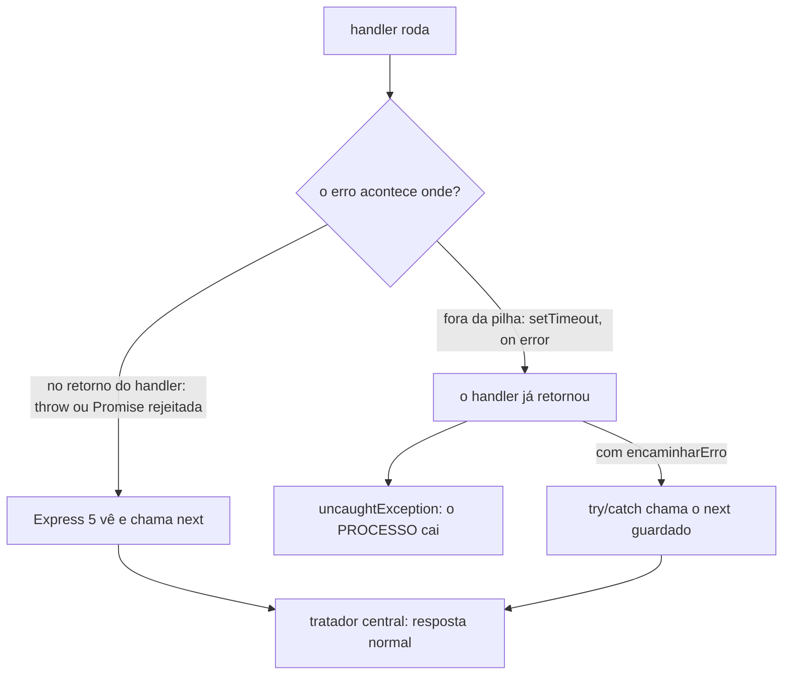

# Middleware — assincrono

📦 módulo 06 · 🧩 grupo 02

A pasta que existe para dizer **não escreva isto**. O wrapper `asyncHandler` que
está em todo tutorial de Express não é mais necessário no Express 5 — e a pasta
prova isso com `curl`, em vez de pedir para você acreditar.

## O problema

O problema é histórico, e é por isso que ele ainda está no seu código.

No **Express 4**, uma rota `async` que rejeitava não chegava ao tratador central.
O framework chamava o handler e ignorava o valor de retorno; a Promise rejeitada
não tinha ninguém escutando, e o resultado era um `unhandledRejection` — a
requisição **pendurava** até o cliente desistir por timeout, e o processo caía
junto se a rede de segurança do processo estivesse configurada
([módulo 06](../../../docs/06-tratamento-de-erros.md#a-rede-de-segurança-do-processo)).

Um `throw` síncrono ia para o tratador; o mesmo `throw` dentro de um `async` não
ia. Duas rotas visualmente idênticas com desfechos opostos, e a diferença era uma
palavra:

|                    | Express 4                         | Express 5        |
| ------------------ | --------------------------------- | ---------------- |
| `throw` síncrono   | vai pro tratador                  | vai pro tratador |
| `throw` em `async` | **pendura, e derruba o processo** | vai pro tratador |

O `asyncHandler` — também chamado `catchAsync`, `wrapAsync`, `ah` — foi a
resposta. Ele envolve o handler, pega o `.catch` e devolve ao `next`. Funcionou,
virou padrão, e está em milhares de tutoriais que continuam no ar.

**A dor de hoje é a solução de ontem.** Quem copia esse padrão em 2026 paga um
custo sem receber nada: toda rota fica com uma camada de embrulho a mais, todo
handler novo depende de alguém lembrar do wrapper, e o esquecimento é invisível
porque o Express já faz o trabalho de qualquer jeito. É código que só existe.

## Como funciona

Duas coisas diferentes moram nesta pasta, e confundi-las é o erro que ela existe
para evitar.

**A primeira é o `assincrono`** — o wrapper, presente como referência de leitura.
Ele não faz nada que o Express 5 já não faça.

**A segunda é o `encaminharErro`** — e essa continua sendo necessária, porque
resolve um problema que o Express não tem como resolver sozinho.

A diferença entre as duas é uma pergunta só: **o Express consegue ver este
erro?** E o que ele consegue ver é exatamente uma coisa — o valor que o handler
**retorna**. Se o handler é `async`, o retorno é uma Promise, e o Express 5
pendura um `.catch` nela: rejeitou, vai para o `next`. É o mecanismo inteiro.

Um `setTimeout` está fora disso. O handler chama `setTimeout`, retorna
`undefined` imediatamente, e o Express segue a vida — não há Promise para
observar. Cinco milissegundos depois o callback dispara, numa pilha de chamadas
nova, criada pelo event loop, onde o Express não está. O `throw` de lá não tem
para onde subir: não há `try` acima, não há Promise abaixo, o `next` daquela
requisição não é alcançável por ninguém. O Node chama isso de
`uncaughtException` e **derruba o processo inteiro** — não a requisição, o
processo, e com ele todas as outras requisições em andamento.



O `encaminharErro` é a ponte: ele guarda o `next` — que continua válido, porque é
uma closure e a requisição continua aberta esperando resposta — e chama-o de
dentro do `catch`, já na pilha nova. É o `next(erro)` que o
[módulo 06](../../../docs/06-tratamento-de-erros.md#nexterro-quando-throw-não-serve)
descreve como "a única saída" nesse caso.

## O código

```ts
import type { NextFunction, Request, RequestHandler, Response } from 'express';

/**
 * Envolve um handler `async` e manda a rejeição para o `next`.
 *
 * `Promise.resolve(...)` e não `handler(...).catch(...)`: o handler pode ser
 * síncrono e devolver `undefined`, e `undefined.catch` é um TypeError dentro do
 * middleware — o wrapper que existe para não deixar erro escapar seria o autor
 * do erro. O `Promise.resolve` normaliza os dois casos.
 *
 * No Express 5 este `.catch(next)` é redundante: o próprio framework já faz
 * isso. Ele está aqui como referência de leitura, não de uso.
 */
export function assincrono(
  handler: (req: Request, res: Response, next: NextFunction) => unknown,
): RequestHandler {
  return (req, res, next) => {
    Promise.resolve(handler(req, res, next)).catch(next);
  };
}

/**
 * Isto sim continua sendo necessário: a ponte de volta para a requisição quando
 * o código roda FORA da pilha dela — dentro de `setTimeout`, de um
 * `emissor.on('error')`, de um callback de biblioteca antiga.
 *
 * O Express só encaminha o que ele consegue ver: o retorno do handler. Quando o
 * `setTimeout` dispara, o handler já retornou e a pilha em que o Express estava
 * esperando não existe mais — o `throw` de lá não tem para onde subir e vira
 * `uncaughtException`, que derruba o processo inteiro (não a requisição: o
 * processo). Guardar o `next` e chamá-lo no `catch` é o que costura os dois
 * lados de novo.
 */
export function encaminharErro(next: NextFunction, tarefa: () => void) {
  try {
    tarefa();
  } catch (erro) {
    next(erro);
  }
}
```

Repare no detalhe do `Promise.resolve` — ele é o motivo de metade dos
`asyncHandler` da internet estarem sutilmente errados. A versão que se escreve
por instinto é `handler(req, res, next).catch(next)`, e ela quebra no dia em que
alguém envolve um handler síncrono no wrapper "por consistência": `undefined` não
tem `.catch`, e o `TypeError` sai de dentro do middleware que existia para
capturar erros.

## Como usar

Ele é middleware **de rota**, aplicado ao handler:

```ts
app.get(
  '/chamados/:id',
  assincrono(async (req, res) => {
    const chamado = await buscar(req.params.id);
    if (!chamado) throw naoEncontrado('Chamado', req.params.id);
    res.json(chamado);
  }),
);
```

E o ponto da pasta é que a versão abaixo, sem wrapper nenhum, faz **a mesma
coisa** no Express 5:

```ts
app.get('/chamados/:id', async (req, res) => {
  const chamado = await buscar(req.params.id);
  if (!chamado) throw naoEncontrado('Chamado', req.params.id);
  res.json(chamado);
});
```

A demo tem as duas rotas lado a lado, `/async/com-wrapper` e
`/async/sem-wrapper`, com o corpo idêntico, e a seção
[Testado assim](#testado-assim) mostra as respostas iguais. É esse "mesmo
resultado" que sustenta o "pode apagar o wrapper".

Para o `encaminharErro` a posição é outra: ele não envolve o handler, ele envolve
o **trecho que roda fora da pilha**, e o `next` é passado à mão porque lá dentro
ele não está mais disponível por escopo do Express:

```ts
app.get('/relatorio', (_req, _res, next) => {
  emissor.on('error', (erro) => {
    encaminharErro(next, () => {
      throw erro; // sem isto, o processo cai
    });
  });
});
```

## As decisões e o porquê

### O wrapper fica no catálogo mesmo sendo desnecessário

**Descartado:** não ter esta pasta, já que o Express 5 resolve o caso.

Custo: você vai encontrar `asyncHandler` em código existente — em projetos que
migraram do Express 4 sem limpar, e em tutoriais que continuam sendo o primeiro
resultado de busca. Sem saber o que ele fazia, a leitura tem dois desfechos
ruins: ou você o copia para o projeto novo achando que é obrigatório, ou o apaga
sem saber se estava segurando alguma coisa. A pasta existe para você **reconhecer
e decidir**, não para você usar.

### A prova é um `curl`, não uma afirmação

**Descartado:** o README dizer "o Express 5 encaminha sozinho" e parar aí.

Custo: essa é exatamente a frase que a pessoa não vai acreditar, porque ela
contradiz o que está escrito em todo lugar. Uma rota `async` sem wrapper que
responde **503** — o status que o próprio erro carrega, formatado pelo tratador
central — é uma evidência que não depende de confiança. E ela é falsificável: se
o encaminhamento não existisse, essa requisição não responderia 503 nem 500,
**não responderia nada** — o `curl` ficaria pendurado até o timeout.

### `Promise.resolve(handler(...))` e não `handler(...).catch(next)`

**Descartado:** chamar `.catch` direto no retorno. Custo: um handler síncrono
envolvido pelo wrapper devolve `undefined`, e `undefined.catch` lança
`TypeError: Cannot read properties of undefined (reading 'catch')` de dentro do
próprio middleware. O erro passa a vir do wrapper, com o `stack` apontando para
ele, e a rota que você estava depurando some do rastro.

### `encaminharErro(next, tarefa)` e não um `try/catch` escrito na rota

**Descartado:** cada `setTimeout` com o seu `try { ... } catch (e) { next(e) }`
inline, que é a mesma coisa em três linhas.

Custo: nenhum tecnicamente — é idêntico. O que a função nomeada compra é a
**visibilidade**: o `try/catch` inline parece defensivo e opcional, e quem faz
uma revisão de código apagando "ruído" tem tudo para tirá-lo. Um `encaminharErro`
tem nome, tem esta pasta e tem um README dizendo que sem ele o processo cai.

### O `encaminharErro` não pega Promise rejeitada

O `try/catch` dele é síncrono: se a `tarefa` for `async`, o `catch` não vê a
rejeição. É deliberado — o caso `async` já é o do wrapper, e uma função que
tratasse os dois teria de decidir se aguarda ou não, sem saber. Para o caso
assíncrono fora da pilha, o que serve é `.catch(next)` diretamente na Promise.

## Onde é fácil errar

| Sintoma                                                                                                                 | Causa                                                                                                                                                         |
| ----------------------------------------------------------------------------------------------------------------------- | ------------------------------------------------------------------------------------------------------------------------------------------------------------- |
| **Falso amigo:** o wrapper foi acrescentado "por segurança" e o `curl` não responde nada, nunca                         | Não é o wrapper: no Express 5 ele é inócuo. O que pendura é `res.json()` que nunca é chamado — um `await` que não resolve, ou um caminho do `if` sem resposta |
| **Falso amigo:** um handler síncrono envolvido no wrapper lança `Cannot read properties of undefined (reading 'catch')` | O wrapper usa `handler(...).catch(...)` sem o `Promise.resolve`. O handler devolveu `undefined`                                                               |
| O processo inteiro morre por causa de uma requisição                                                                    | `throw` dentro de `setTimeout`, `setInterval` ou `.on('error')`, sem o `encaminharErro`. O handler já tinha retornado; virou `uncaughtException`              |
| A rota `async` responde 500 e você esperava 404                                                                         | O encaminhamento funcionou — o problema é o erro lançado. Um `Error` comum não tem `status` nem `esperado`, então o tratador o classifica como bug            |
| O erro chega ao tratador, mas o corpo sai truncado                                                                      | O handler já tinha respondido antes de lançar. É a guarda `res.headersSent` do [tratador](../tratador-de-erros/README.md) fazendo o certo                     |
| `next()` chamado depois de a requisição terminar                                                                        | O `encaminharErro` está numa closure de um `setInterval` que continua rodando depois da resposta. O `next` é válido, a resposta não                           |

## O que ele não faz

- **Não substitui a rede de segurança do processo.** O `encaminharErro` cobre o
  callback em que você lembrou de pôr o `encaminharErro`. Todo o resto —
  biblioteca que emite `error` sem você escutar, Promise solta num módulo —
  continua chegando em `uncaughtException` e `unhandledRejection`, e a
  recomendação lá é **logar e sair**
  ([módulo 06](../../../docs/06-tratamento-de-erros.md#a-rede-de-segurança-do-processo)).
- **Não faz o `res` esperar.** Se o handler já respondeu e o erro vem depois, não
  há resposta a corrigir. O tratador devolve ao Express, que derruba a conexão.
- **Não cancela nada.** O trabalho assíncrono que falhou continua onde estava —
  conexão de banco ocupada, arquivo meio escrito. Encaminhar o erro conserta a
  resposta, não o efeito colateral.
- **Não desiste de esperar.** Um `await` que nunca resolve pendura a requisição
  para sempre, e nada aqui percebe. Quem trata disso é o
  [`timeout` do grupo 04](../../04-desempenho-e-convencao/README.md).

## Testado assim

Servidor: `node middlewares/02-validacao-e-erros/servidor.ts` (porta 6102).

As duas rotas da demo têm o corpo idêntico — `await` de 5ms e
`throw new AppError('O sistema de chamados não respondeu a tempo', 503)` — e a
única diferença é o wrapper. Primeiro a que tem:

```bash
curl.exe -s http://localhost:6102/async/com-wrapper
```

```
HTTP/1.1 503 Service Unavailable
{"erro":"O sistema de chamados não respondeu a tempo","status":503}
```

E agora a mesma coisa **sem wrapper nenhum** — um `async` cru registrado direto
no `app.get`:

```bash
curl.exe -s http://localhost:6102/async/sem-wrapper
```

```
HTTP/1.1 503 Service Unavailable
{"erro":"O sistema de chamados não respondeu a tempo","status":503}
```

**Byte por byte a mesma resposta. É a prova da pasta inteira.**

Vale ler esse 503 com atenção, porque ele é fácil de interpretar errado. **O 503
não é um timeout** — nada desistiu de esperar. É o status que o `AppError`
lançado pela rota carrega, escolhido para a mensagem fazer sentido, e ele só
aparece porque o Express 5 pegou a Promise rejeitada e a levou ao tratador
central, que leu o `status` de dentro do erro. Se o encaminhamento não existisse
— o mundo do Express 4 —, não haveria 503 nem 500: o `curl` ficaria **pendurado**
até o timeout do cliente, sem resposta nenhuma.

Agora o que continua **não** sendo automático. A rota `/async/fora-da-pilha`
lança de dentro de um `setTimeout`, cinco milissegundos depois de o handler ter
retornado:

```bash
curl.exe -s http://localhost:6102/async/fora-da-pilha
```

```
HTTP/1.1 500 Internal Server Error
{"erro":"Erro interno do servidor","status":500}
```

Um 500 comum, com a mensagem genérica e a stack só no log — porque o
`encaminharErro` está lá, e ele levou o erro de volta ao `next` da requisição.
**Sem ele**, esse mesmo `throw` não teria para onde subir: viraria
`uncaughtException` e derrubaria o processo. E a diferença entre as duas coisas é
o `curl` seguinte, feito logo depois:

```bash
curl.exe -s http://localhost:6102/chamados/1
```

```
HTTP/1.1 200 OK
{"id":1,"titulo":"Impressora do 3º andar sem tinta","prioridade":"baixa","contrato":"ACM-1042"}
```

**O servidor continuou de pé.** É esse 200 que separa "uma requisição falhou" de
"a API saiu do ar" — e é a única coisa que distingue as duas situações de fora,
porque o corpo do erro é igual nas duas.
