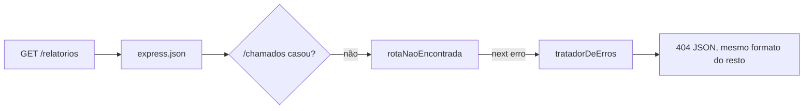

# Middleware — nao-encontrado

📦 módulo 06 · 🧩 grupo 02

O 404 que fecha a pilha: quando nenhuma rota casou com a requisição, ele lança um
erro em vez de deixar o Express responder o que responde por padrão.

## O problema

Uma API que fala JSON precisa falar JSON também quando o cliente errou o
endereço. Sem este middleware, ela não fala.

O que acontece sem ele é fácil de conferir e quase ninguém confere, porque o
status sai certo. Uma requisição a uma rota que não existe percorre a pilha
inteira, nenhuma camada responde, e o Express chega ao fim do arquivo sem nada
para chamar. Aí entra o **`finalhandler`** — o desfecho que o Express registra
sozinho para o caso de ninguém ter respondido — e ele responde uma **página
HTML**:

```
HTTP/1.1 404 Not Found
Content-Type: text/html; charset=utf-8
Content-Security-Policy: default-src 'none'

<!DOCTYPE html>
<html lang="en">
<head><title>Error</title></head>
<body><pre>Cannot GET /relatorios</pre></body>
</html>
```

E aí o cliente quebra num lugar que não tem nada a ver com o erro. Quem consome
uma API JSON escreve `const corpo = await resposta.json()`, e `resposta.json()`
num `<!DOCTYPE html>` lança `SyntaxError: Unexpected token '<', "<!DOCTYPE "...
is not valid JSON`. A mensagem que chega no monitoramento do time do front fala
de token e de DOCTYPE; a causa é uma barra a mais na URL. Já vi esse erro ser
investigado como bug de serialização.

Há um segundo problema, menor mas do mesmo tipo: o `Cannot GET /relatorios` é
uma frase em inglês, com formato só dela, numa API cujos outros erros saem
`{ erro, status }` em português. O cliente que já tem o tratamento de erro
pronto precisa de um caso extra só para este.

## Como funciona

Ele é um middleware comum de três argumentos — nada de especial na assinatura.
O que o torna o 404 é **onde ele é registrado**: depois de todas as rotas.

A pilha do Express é percorrida em ordem ([módulo 05](../../../docs/01-05/05-middlewares.md#a-ordem-é-a-ordem-do-arquivo)),
e uma rota só entra na conversa se o método e o caminho baterem. Quando nenhuma
bate, a requisição continua descendo — e o primeiro middleware sem restrição de
caminho que encontrar depois delas é este. Ou seja: **chegar aqui já é a prova
de que nenhuma rota casou.** Ele não precisa procurar nada, não tem lista de
rotas conhecidas, não consulta o roteador. A posição é a lógica inteira.

O que ele faz com essa informação é uma linha: `next(erro)`. Ele não responde.
Quem responde é o [tratador central](../tratador-de-erros/README.md), que já
sabe transformar um erro com `status` e `esperado` no `{ erro, status }` de
sempre.



## O código

```ts
import type { NextFunction, Request, Response } from 'express';

export class ErroDeRotaInexistente extends Error {
  readonly status = 404;
  /** Mesma marca do resto do grupo: erro de propósito, não bug. */
  readonly esperado = true;

  constructor(mensagem: string) {
    super(mensagem);
    this.name = 'ErroDeRotaInexistente';
  }
}

export function rotaNaoEncontrada(req: Request, _res: Response, next: NextFunction) {
  // `req.path` e não `req.originalUrl`: o `originalUrl` carrega a query string
  // junto, e a query string carrega o que o cliente puser nela — inclusive
  // `?token=...`. Devolver isso no corpo e escrevê-lo no log é como um segredo
  // acaba dentro do agregador de logs, onde meio time tem acesso.
  const mensagem = `Rota ${req.method} ${req.path} não existe`;

  // `next(erro)` e não `res.status(404).json(...)`: respondendo aqui, o 404 de
  // rota inexistente sairia num formato só dele, diferente dos outros erros da
  // API. Empurrando para o tratador central, ele sai com o mesmo `{ erro,
  // status }` de todo o resto — um formato só para o cliente tratar.
  next(new ErroDeRotaInexistente(mensagem));
}
```

A classe própria em vez do `AppError` da pasta vizinha é a regra de a pasta ser
copiável: nenhum `middleware.ts` deste catálogo importa de outro. Se o seu
projeto já tem um `AppError`, apague a classe daqui e troque a última linha por
`next(new AppError(mensagem, 404))` — o tratador aceita os dois, porque ele
confere o **formato** do erro (`status` numérico e `esperado: true`), não a
classe.

## Como usar

Duas linhas, e a ordem entre elas e o resto do arquivo é o assunto da pasta:

```ts
app.use(express.json());
app.use('/chamados', rotas); // ← todas as rotas primeiro

app.use(rotaNaoEncontrada); // ← depois de TODAS as rotas
app.use(tratadorDeErros); // ← e antes do tratador de erro
```

Ele fica espremido entre duas coisas, e trocá-lo de lugar em qualquer uma das
duas direções quebra de um jeito diferente. Vale ver as duas.

### Inversão 1 — o 404 antes de alguma rota

```ts
app.use(rotaNaoEncontrada); // ❌
app.use('/chamados', rotas);
```

**Sintoma: a API inteira responde 404.** Como este middleware não tem caminho, o
Express o chama em **toda** requisição, e ele chama `next(erro)` em todas —
inclusive nas que teriam casado com `/chamados` logo abaixo. O `next` com
argumento pula direto para o próximo middleware de erro; as rotas ficam para
trás e nunca rodam.

O caso cruel é a inversão parcial, que é a que acontece de verdade: alguém
acrescenta um `app.use('/relatorios', ...)` **depois** da linha do 404, meses
depois, porque a linha nova naturalmente vai para o fim do arquivo. As rotas
antigas continuam funcionando, e só as novas dão 404 — sem erro, sem log, sem
nada que aponte para a ordem.

### Inversão 2 — o 404 depois do tratador

```ts
app.use(tratadorDeErros); // ❌
app.use(rotaNaoEncontrada);
```

**Sintoma: volta o HTML.** O `next(erro)` procura o próximo middleware de erro
**a partir da posição de quem chamou** — e o tratador ficou para trás. Não há
próximo, então o erro cai no `finalhandler`, que é exatamente o que este
middleware existe para evitar. Rodado nas duas ordens, com a mesma requisição:

```
# rotaNaoEncontrada antes do tratador — o certo
HTTP/1.1 404 Not Found
Content-Type: application/json
{"erro":"Rota GET /rota-que-nao-existe não existe","status":404}

# tratador antes do 404 — o errado
HTTP/1.1 404 Not Found
Content-Type: text/html; charset=utf-8
<!DOCTYPE html>
...
<pre>ErroDeRotaInexistente: Rota GET /rota-que-nao-existe não existe<br> &nbsp; at
rotaNaoEncontrada (file:///C:/Users/otavi/.../nao-encontrado/middleware.ts:32:8)<br> ...
```

**O status é 404 nas duas.** É por isso que esta inversão sobrevive a testes:
qualquer asserção sobre `resposta.status` passa. O que muda é o `Content-Type` e
o caminho absoluto do seu projeto dentro do corpo — e um teste que confira o
formato do erro, não só o status, é a única coisa que pega isso
([módulo 12](../../../docs/11-15/12-testes.md)).

## As decisões e o porquê

### `next(erro)` e não `res.status(404).json(...)`

**Descartado:** responder aqui mesmo, que é o que a maioria dos exemplos faz e
funciona perfeitamente no primeiro dia.

Custo: o formato da resposta de erro passa a ser decidido em dois lugares. No dia
em que alguém acrescentar `requestId` no corpo dos erros
([grupo 01](../../01-requisicao-e-resposta/README.md)), vai acrescentar no
tratador central — e o 404 de rota inexistente, que é justamente o erro que o
cliente mais recebe enquanto integra, vai ficar sem. Ninguém percebe, porque
nada quebra: só existe um campo a menos, num caso só.

Passando pelo tratador, o formato tem uma fonte de verdade. É a mesma escolha que
o [`validar`](../validar/README.md) faz com o 422, e pela mesma razão.

### `req.path` e não `req.originalUrl`

**Descartado:** `req.originalUrl`, que dá uma mensagem mais completa —
`Rota GET /relatorios?token=eyJhbGci... não existe` em vez de
`Rota GET /relatorios não existe`.

Custo: o que veio na query string veio do cliente, e mensagem de erro vai para
dois lugares — o corpo da resposta e o log. Um token na URL (prática ruim, mas
comum em integrações antigas) fica gravado no agregador de logs, onde o acesso é
muito mais largo que o do banco. E o corpo da resposta é copiado em issue, em
print, em ticket de suporte.

O que se perde é real: sem a query, dois 404 diferentes viram a mesma linha de
log. Se você precisa da query para depurar, registre-a numa linha de log com o
id da requisição, não na mensagem que o cliente lê.

> **Atenção:** `req.path` também não é confiável como texto puro para log. Ele
> vem do cliente e pode conter quebra de linha percent-encoded. O
> [`id-de-requisicao` do grupo 01](../../01-requisicao-e-resposta/README.md) trata
> o mesmo problema no cabeçalho `X-Request-Id` e vale a leitura antes de escrever
> este valor num log de linhas.

### A mensagem diz o método junto do caminho

`Rota GET /chamados não existe` e não `Rota /chamados não existe`. Método e
caminho juntos são o que identifica uma rota no Express: um `POST /chamados` que
existe e um `GET /chamados` que não existe são endereços diferentes. Sem o
método, quem esqueceu o `-X POST` no `curl` lê "essa rota não existe", vai
conferir o roteador, encontra a rota lá, e perde dez minutos.

**Descartado:** só o caminho. Custo: os dez minutos, toda vez.

### 404 e não 501 ou 405

**Descartado:** `405 Method Not Allowed` quando o caminho existe mas o método
não. Ele é o status correto por especificação — e exige o cabeçalho `Allow`
listando os métodos aceitos, o que obriga a consultar a tabela de rotas do
Express para saber quais são. Custo: acoplar este middleware ao formato interno
do roteador, que é o que muda entre versões maiores do Express, em troca de uma
distinção que quase nenhum cliente usa.

## Onde é fácil errar

| Sintoma                                                                                  | Causa                                                                                                                                                                           |
| ---------------------------------------------------------------------------------------- | ------------------------------------------------------------------------------------------------------------------------------------------------------------------------------- |
| **Falso amigo:** o 404 sai com status certo, e o front quebra com `Unexpected token '<'` | O middleware está registrado **depois** do tratador de erro. O `next(erro)` não acha tratador nenhum à frente e cai no `finalhandler`, que responde HTML. O status não denuncia |
| A API inteira responde 404, inclusive as rotas que existem                               | Ele foi registrado antes das rotas. Sem caminho, ele roda em tudo, e o `next(erro)` pula o resto da pilha                                                                       |
| Só as rotas novas dão 404; as antigas funcionam                                          | Inversão parcial: alguém acrescentou `app.use(...)` no fim do arquivo, depois da linha do 404                                                                                   |
| Um token aparece no log de erro                                                          | `req.originalUrl` no lugar de `req.path`                                                                                                                                        |
| `GET /chamados` responde 404 e a rota está lá no arquivo                                 | A rota existe com outro método. A mensagem traz o método por causa disso                                                                                                        |
| O 404 sai `{ erro, status }` mas o 404 de "chamado 999 não existe" sai diferente         | São dois 404 distintos e os dois passam pelo tratador — se o formato diverge, um dos dois está respondendo direto em vez de lançar                                              |

Vale separar os dois 404 da última linha, porque eles se confundem: **rota
inexistente** é "este endereço não existe nesta API" e quem decide é este
middleware; **recurso inexistente** é "o endereço existe, o chamado 999 não" e
quem decide é a rota, com `throw naoEncontrado('Chamado', 999)`. O status é o
mesmo por acaso feliz, o motivo não.

## O que ele não faz

- **Não trata arquivo estático.** Se a sua aplicação serve HTML ou assets, o
  `express.static` precisa vir **antes** dele; caso contrário todo arquivo vira
  404 JSON. Numa API que só fala JSON, o caso não existe.
- **Não distingue método errado de caminho errado.** Ver a decisão sobre o 405
  acima.
- **Não responde nada.** Sem o [tratador central](../tratador-de-erros/README.md)
  registrado depois dele, ele piora a situação em vez de melhorar — o erro cai no
  `finalhandler` e o corpo passa a trazer a stack, que o `Cannot GET` original
  nem tinha.
- **Não protege contra varredura.** Alguém tentando descobrir os endereços da sua
  API recebe 404 e segue tentando. Limitar a taxa é o
  [`limitar` do grupo 03](../../03-acesso-e-seguranca/README.md).

## Testado assim

Servidor: `node middlewares/02-validacao-e-erros/servidor.ts` (porta 6102).

```bash
# rota que não existe: JSON, com método e caminho na mensagem
curl.exe -s http://localhost:6102/rota-que-nao-existe
```

```
HTTP/1.1 404 Not Found
{"erro":"Rota GET /rota-que-nao-existe não existe","status":404}
```

O mesmo formato `{ erro, status }` do 404 de recurso inexistente, que vem da
rota e não daqui:

```bash
curl.exe -s http://localhost:6102/chamados/999
```

```
HTTP/1.1 404 Not Found
{"erro":"Chamado 999 não encontrado","status":404}
```

Dois caminhos completamente diferentes — um middleware no fim da pilha, um
`throw` dentro de um handler — chegando ao mesmo corpo. É o que o `next(erro)`
compra: o cliente escreve um tratamento só.
