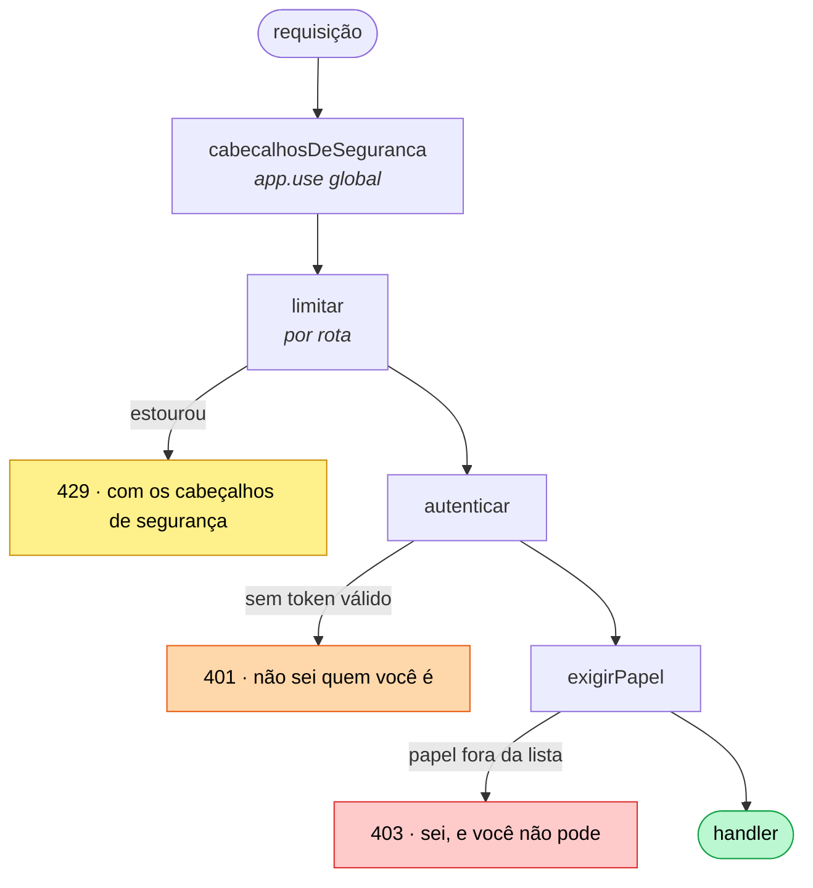

# Grupo 03 — acesso e segurança

📦 módulos 11 e 13 · 🔌 porta 6103

Quem é, o que pode, e quanto pode pedir. São as três perguntas que uma API
precisa responder antes de fazer qualquer trabalho — mais os cabeçalhos que ela
manda de volta em toda resposta, inclusive nas de erro.

| Middleware                                                       | O que faz                                                                                          |
| ---------------------------------------------------------------- | -------------------------------------------------------------------------------------------------- |
| [`autenticar`](./autenticar/README.md)                           | Confere o `Bearer <token>` com `jwt.verify` e escreve `req.usuario`. Falhou, **401**               |
| [`exigir-papel`](./exigir-papel/README.md)                       | Fábrica que autoriza: sem o papel na lista de quem pode, **403**                                   |
| [`limitar`](./limitar/README.md)                                 | Conta requisições por cliente numa janela e responde **429**. Duas versões: à mão e com biblioteca |
| [`cabecalhos-de-seguranca`](./cabecalhos-de-seguranca/README.md) | `helmet` ajustado para API JSON — e o que dele **não** serve aqui                                  |

Os quatro se leem em qualquer ordem, mas a de cima para baixo é a da pilha: os
cabeçalhos valem para toda resposta, o limite decide se vale gastar recurso com
ela, a autenticação diz quem está falando e a autorização diz se pode.

## A pilha, e por que nesta ordem



Três posições que não são preferência:

- **`cabecalhosDeSeguranca` primeiro de todos.** Um middleware que só põe
  cabeçalho tem que rodar antes de qualquer coisa capaz de responder — senão o
  429 e o 500 saem sem eles, e a resposta de erro é a que mais tende a vazar
  informação.
- **`limitar` antes do trabalho caro.** O ponto de um limitador é não gastar
  recurso com a requisição excedente. Depois do `autenticar`, ele já pagou a
  verificação do token.
- **`exigirPapel` depois do `autenticar`, sempre.** Invertido, ele lê um
  `req.usuario` que ainda não existe e responde 401 para todo mundo — inclusive
  para o admin com token perfeito.

## Rodar a demo

```bash
node middlewares/03-acesso-e-seguranca/servidor.ts
```

O `servidor.ts` é demonstração, não aplicação: ele monta a pilha e expõe o
mínimo de rota para cada middleware aparecer num `curl`. Não precisa de banco,
nem de variável de ambiente.

| Rota                   | O que exercita                                    |
| ---------------------- | ------------------------------------------------- |
| `GET /publico`         | Só os cabeçalhos do helmet                        |
| `POST /sessoes?papel=` | Emite o token para os outros `curl`               |
| `GET /eu`              | `autenticar` sozinho                              |
| `DELETE /acervo/:id`   | `autenticar` + `exigirPapel('admin')` — 401 × 403 |
| `GET /catalogo`        | `limitar` na versão à mão                         |
| `GET /busca`           | `limitar` com `express-rate-limit`                |

Um `curl` para começar, que já mostra o efeito mais fácil de verificar do grupo
— a ausência do `X-Powered-By`:

```bash
curl.exe -s -i http://localhost:6103/publico
```

> **Atenção:** rode pelo Git Bash com `curl.exe`. E repare que
> `POST /sessoes` recebe o papel por **query string** (`?papel=leitor`), não por
> corpo JSON: é para o `curl` caber numa linha sem aspas que o PowerShell
> estraga. Numa API de verdade isso seria erro — a query aparece no log de
> acesso e no `Referer`.

## O que este grupo não cobre

- **Login de verdade.** `POST /sessoes` não confere senha nenhuma. Hash com
  Argon2, comparação em tempo constante e refresh token estão no
  [módulo 11](../../docs/11-15/11-autenticacao.md).
- **Autorização por dono do recurso.** "Só o autor edita o próprio post" precisa
  buscar o recurso para comparar, e por isso mora no service
  ([módulo 08](../../docs/06-10/08-arquitetura-em-camadas.md)), não num middleware.
- **Contador de rate limit compartilhado.** As duas versões contam na memória de
  um processo; com dois, o teto real dobra. Redis, no módulo 15.
- **CORS.** Helmet não faz CORS, e os dois são confundidos com frequência —
  [módulo 13](../../docs/11-15/13-seguranca.md#cors-o-que-ele-faz-e-o-que-ele-definitivamente-não-faz).

Cada pasta traz o seu limite honesto por extenso, na seção `## O que ele não
faz`.
