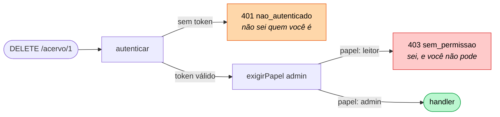

# Middleware — exigir-papel

📦 módulo 11 · 🧩 grupo 03

Fábrica que autoriza: `exigirPapel('admin')` deixa passar quem tem o papel e
responde **403** para quem não tem.

## O problema

O [`autenticar`](../autenticar/README.md) provou quem é. Falta a segunda
pergunta, que é outra: **e você pode isto?**

A tentação é responder dentro da rota, onde a informação está toda à mão:

```ts
// ❌ a regra dentro do handler
app.delete('/acervo/:id', autenticar, async (req, res) => {
  if (req.usuario?.papel !== 'admin') {
    return res.status(403).json({ erro: 'sem permissão' });
  }
  await repo.remover(req.params.id);
  res.json({ removido: req.params.id });
});
```

Funciona, e some. Três meses depois:

- **A regra não é achável.** Para responder "quem pode apagar do acervo?", alguém
  precisa abrir cada handler e procurar o `if`. Com trinta rotas, a resposta é
  uma leitura de trinta arquivos, e ninguém tem certeza de tê-la encontrado toda.
- **O `return` antecipado escapa.** Uma refatoração move a busca do recurso para
  antes do `if`, e a rota passa a apagar antes de conferir. O `if` continua ali,
  ainda parece proteger, e não protege mais.
- **A rota nova nasce aberta.** Copiada de outra rota autenticada, ela vem com o
  `autenticar` e sem o `if`. Fica protegida contra anônimos e liberada para todo
  usuário logado — que é a categoria de falha mais comum em APIs, o
  [Broken Access Control](../../../docs/11-15/13-seguranca.md#broken-access-control--o-erro-nº-1-na-prática).

Autorizar é decisão **diferente** de autenticar, e separá-las em dois middlewares
é o que impede a regra de sumir dentro da rota. Na linha
`app.delete('/acervo/:id', autenticar, exigirPapel('admin'), handler)`, quem pode
o quê é legível sem abrir o handler.

## Como funciona

`exigirPapel` não é o middleware: é a **fábrica**
([módulo 05](../../../docs/01-05/05-middlewares.md#middleware-com-argumento-fábrica))
que devolve um, já fechado sobre a lista de papéis permitidos. É por isso que a
mesma função atende `exigirPapel('admin')` e `exigirPapel('admin', 'editor')` sem
duas cópias.

O middelware devolvido lê `req.usuario` — que ele **não escreve nunca** — e toma
uma de três saídas:

| Situação                      | Resposta | Significado                      |
| ----------------------------- | -------- | -------------------------------- |
| `req.usuario` ausente         | **401**  | Não sei quem você é              |
| Papel presente, fora da lista | **403**  | Sei quem você é, e você não pode |
| Papel na lista                | `next()` | Segue para o handler             |

A primeira linha da tabela é o ponto sutil. Chegar aqui sem `req.usuario`
significa que a rota esqueceu o `autenticar` — é bug de quem montou a pilha, não
do cliente. A resposta segura mesmo assim é **negar**: uma checagem de permissão
que libera quando dá errado é pior do que não ter checagem nenhuma, porque dá
confiança.

### 401 × 403

Os dois negam. A diferença é o que o servidor sabe no momento de negar, e ela
importa para quem consome a API: no **401** vale tentar de novo com credencial;
no **403** não adianta insistir, o token está certo e a resposta seria a mesma
amanhã.



O nome `401 Unauthorized` no padrão HTTP é infeliz — ele é sobre **autenticação**,
e quem lê a palavra sem o contexto troca os dois. O
[módulo 11](../../../docs/11-15/11-autenticacao.md#as-duas-palavras) tem a tabela
completa.

## O código

O arquivo está em [`middleware.ts`](./middleware.ts).

```ts
export function exigirPapel(...papeisPermitidos: Papel[]) {
  if (papeisPermitidos.length === 0) {
    // `exigirPapel()` sem argumento negaria tudo, ou — pior, se a checagem fosse
    // `includes` numa lista vazia com o sinal trocado — liberaria tudo. Lançar
    // aqui estoura quando as rotas são montadas, na subida do servidor, e não na
    // primeira requisição em produção.
    throw new Error('exigirPapel() precisa de ao menos um papel');
  }

  return (req: Request, res: Response, next: NextFunction) => {
    const usuario = req.usuario;

    // Na dúvida, feche a porta: sem `req.usuario`, a rota esqueceu o
    // `autenticar`. 401 e não 403, porque neste ponto o servidor de fato não
    // sabe quem é.
    if (!usuario) {
      res.status(401).json({
        erro: 'nao_autenticado',
        mensagem: 'Rota protegida sem o middleware de autenticação',
      });
      return;
    }

    if (!papeisPermitidos.includes(usuario.papel)) {
      // Aqui a mensagem PODE ser específica, ao contrário do 401: o usuário já
      // se identificou, e dizer qual papel falta economiza um chamado.
      res.status(403).json({
        erro: 'sem_permissao',
        mensagem: `Esta operação exige um destes papéis: ${papeisPermitidos.join(', ')}`,
      });
      return;
    }

    next();
  };
}
```

A validação da própria lista, no topo, roda **uma vez por rota registrada**, no
momento em que o Express monta a pilha — antes de a primeira requisição chegar.
`exigirPapel()` sem argumento derruba o servidor na subida, com a linha exata no
stack trace. A alternativa, checar dentro do middleware, transformaria o mesmo
engano num 403 misterioso em produção, na rota que ninguém testou.

O arquivo repete a declaração `declare module 'express-serve-static-core'` do
[`autenticar`](../autenticar/README.md#o-pedaço-que-todo-mundo-copia-errado), e a
repetição é de propósito: é o que faz esta pasta compilar sozinha ao ser copiada.
Augmentação repetida com o **tipo idêntico** é união de declarações, não
conflito. Mudar um campo aqui e não lá é que quebra a compilação — e é bom que
quebre.

## Como usar

```ts
app.delete('/acervo/:id', autenticar, exigirPapel('admin'), handler);
app.patch('/acervo/:id', autenticar, exigirPapel('admin', 'editor'), handler);
```

**Sempre depois do `autenticar`, na mesma linha da rota.** A ordem é a ordem do
argumento, e não há nada que a torne implícita: este middleware assume que o
outro já rodou e escreveu `req.usuario`.

Invertido, o resultado é este:

```ts
// ❌ exigirPapel antes de autenticar
app.delete('/acervo/:id', exigirPapel('admin'), autenticar, handler);
```

O `exigirPapel` roda primeiro, lê um `req.usuario` que ainda é `undefined`, cai
na primeira saída e responde **401 para todo mundo** — inclusive para o admin com
token perfeito. A rota fica inacessível, o `autenticar` nunca chega a rodar, e o
sintoma ("meu token está certo e recebo 401") aponta para o middleware errado.

É por isso que a mensagem daquele 401 é `'Rota protegida sem o middleware de
autenticação'` e não a mesma frase genérica do `autenticar`: ela existe para
dizer onde procurar.

**Não use `app.use(exigirPapel('admin'))` global.** Um middleware de nível de
aplicação atinge inclusive a rota de login e a de saúde, e você descobre isso
quando ninguém consegue mais pedir um token. Autorização é decisão por rota, ou
por router de um prefixo inteiro cujas rotas compartilham a mesma regra.

## As decisões e o porquê

### Variádica (`...papeis`), e não um middleware por papel

`exigirPapel('admin', 'editor')` significa **admin OU editor**. A alternativa —
empilhar `exigirPapel('admin')` e `exigirPapel('editor')` na mesma rota —
significaria **E**, não OU: o primeiro já negaria o editor antes de o segundo
rodar. E "admin E editor" não é um caso que exista, já que cada usuário tem um
papel só.

Custo da escolha: não há como expressar regra composta ("editor, mas só no
próprio setor") com esta assinatura. Essa regra precisa do recurso em mãos e por
isso mora no service, não aqui — veja
[`## O que ele não faz`](#o-que-ele-não-faz).

### Lista de quem **pode**, nunca de quem não pode

`bloquearPapel('visitante')` parece equivalente e não é. O papel criado no mês
que vem — `auditor`, `estagiario`, `integracao` — entra **liberado por omissão**,
e ninguém abriu esta linha para decidir isso.

A diferença é para que lado cada uma erra:

| Lista        | Quando erra                | Consequência        |
| ------------ | -------------------------- | ------------------- |
| **Positiva** | Esqueceu de incluir alguém | Chamado de suporte  |
| **Negativa** | Esqueceu de excluir alguém | Incidente de acesso |

Custo da lista positiva: cada papel novo obriga a revisar as rotas que ele
deveria alcançar, e alguém vai reclamar de acesso negado antes de a revisão
acontecer. É o custo barato dos dois.

### Nega em silêncio quando o `autenticar` faltou

A alternativa seria lançar um erro de programação — `throw new Error('rota mal
montada')` — para o bug aparecer alto e claro no log em vez de virar um 401
comum. É defensável, e mudaria o status de 401 para 500.

O que decidiu: um 500 numa rota protegida diz ao cliente que o servidor quebrou,
quando na verdade o acesso foi corretamente negado. O 401 é a resposta honesta —
o servidor de fato não sabe quem está falando — e a mensagem específica cumpre o
papel de apontar o bug para quem lê o corpo.

Custo: o bug de pilha mal montada fica menos visível. Um `console.warn` ao lado
do 401 seria o meio-termo, e não está aqui porque o middleware não escreve log
(veja o [`log`](../../01-requisicao-e-resposta/log/README.md) do grupo 01).

### O 403 diz qual papel falta, o 401 não diz nada

No [`autenticar`](../autenticar/README.md#o-401-é-o-mesmo-nos-quatro-casos) a
mensagem é deliberadamente vaga, porque detalhar orienta quem está forjando
token. Aqui é o contrário: o usuário **já se identificou**, e não há nada a
esconder dele que ele não descubra tentando. Dizer "exige um destes papéis:
admin" economiza um chamado de suporte.

Custo: a mensagem revela a estrutura de papéis da API para qualquer usuário
autenticado. Numa API em que os nomes dos papéis são eles próprios sensíveis
(`auditor_interno`, `compliance`), a frase volta a ser genérica.

## Onde é fácil errar

| Sintoma                                                             | Causa                                                                                                                                                                      |
| ------------------------------------------------------------------- | -------------------------------------------------------------------------------------------------------------------------------------------------------------------------- |
| 401 em todo mundo, inclusive no admin com token perfeito            | `exigirPapel` registrado **antes** do `autenticar`. Ele lê `req.usuario` antes de existir e nega na primeira saída                                                         |
| A rota parece protegida e todo usuário logado consegue apagar       | **O falso amigo:** só `autenticar` na rota. Ele prova que é **alguém**, não que é quem pode. "Autenticada" e "autorizada" não são a mesma coisa                            |
| 403 para um token que tem o papel certo                             | O `papel` não chegou em `req.usuario` — o `autenticar` foi trocado por uma versão que não valida a carga. O 401 com a mensagem certa é o que evita isso                    |
| Papel novo criado no banco e ninguém consegue usá-lo                | A lista positiva não foi revisada. É o custo declarado da escolha, e o sintoma correto                                                                                     |
| `exigirPapel()` sem argumento e todas as rotas negam                | Não acontece: o `throw` da fábrica derruba o servidor na subida, com a linha no stack trace                                                                                |
| Usuário A lê o recurso do usuário B, os dois com papel `leitor`     | Papel não é dono. Esta checagem precisa buscar o recurso e mora no service ([módulo 08](../../../docs/06-10/08-arquitetura-em-camadas/README.md))                          |
| Alguém rebaixado de admin continua apagando por mais alguns minutos | O papel vem congelado no token, e ele vale até expirar. É a contrapartida do JWT, descrita no [módulo 11](../../../docs/11-15/11-autenticacao.md#permissão-por-papel-rbac) |

## O que ele não faz

- **Não autentica.** Ele lê `req.usuario` e nunca o escreve. Quem escreve é o
  [`autenticar`](../autenticar/README.md).
- **Não autoriza por dono do recurso.** "Só o autor edita o próprio empréstimo"
  não cabe aqui: essa regra precisa **buscar o recurso** para comparar o dono com
  quem pediu, e um middleware que roda antes do handler não tem o recurso em mãos.
  Ela mora no service
  ([módulo 08](../../../docs/06-10/08-arquitetura-em-camadas/README.md)), e o
  [módulo 13](../../../docs/11-15/13-seguranca.md#broken-access-control--o-erro-nº-1-na-prática)
  mostra o caso completo, inclusive por que a resposta ali costuma ser 404 e não
  403 — um 403 confirmaria que o recurso existe.
- **Não faz permissão granular.** `RBAC` amarra permissões a papéis; sistemas que
  precisam de "pode editar o campo X mas não o campo Y" usam outro modelo (ABAC,
  permissões nomeadas), e nenhum deles cabe numa lista de strings.
- **Não consulta o banco.** O papel vem do token, e é isso que dispensa uma
  consulta por requisição. A contrapartida está na tabela acima: rebaixar alguém
  só tem efeito quando o token expira.
- **Não registra a negativa.** Uma tentativa de acesso negado é exatamente o
  evento que se quer ver num painel — e transformá-la em log estruturado e alerta
  é assunto do [módulo 14](../../../docs/11-15/14-observabilidade.md).

## Testado assim

Servidor: `node middlewares/03-acesso-e-seguranca/servidor.ts` (porta 6103).

A rota `DELETE /acervo/:id` está montada como
`autenticar, exigirPapel('admin')` — os dois lado a lado mostram os dois status.

**Com token de `leitor` — 401 passou, 403 barrou:**

```bash
curl.exe -s -X DELETE http://localhost:6103/acervo/1 \
  -H "Authorization: Bearer <token de leitor>"
```

```json
{
  "erro": "sem_permissao",
  "mensagem": "Esta operação exige um destes papéis: admin"
}
```

O token é válido e o `autenticar` deixou passar. Quem negou foi o `exigirPapel`,
e o status diz exatamente isso: **sei quem você é, e você não pode**.

**Com token de `admin` — 200:**

```bash
curl.exe -s -X POST "http://localhost:6103/sessoes?papel=admin&usuario=chefe"
curl.exe -s -X DELETE http://localhost:6103/acervo/1 \
  -H "Authorization: Bearer <token de admin>"
```

```json
{ "removido": "1", "por": "chefe" }
```

O `por` veio de `req.usuario.id`, que o `autenticar` escreveu — a mesma rota
consegue dizer **quem** apagou porque a identidade atravessou os dois
middlewares.

**Sem token nenhum — 401, e a diferença fica visível lado a lado:**

```bash
curl.exe -s -i http://localhost:6103/eu
```

```http
HTTP/1.1 401 Unauthorized
```

Mesma família de rotas, dois motivos diferentes de negar: aqui o servidor não
sabe quem está pedindo; no 403 acima ele sabe, e a resposta continua não.
