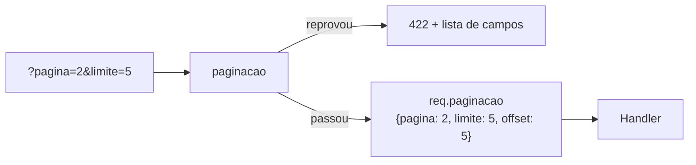

# Middleware — paginacao

📦 módulo 07 · 🧩 grupo 04

Lê `?pagina=` e `?limite=` uma vez só, valida os dois, e entrega à rota os três
números que ela precisa: `pagina`, `limite` e `offset`.

## O problema

O acervo tem 25 livros hoje e vai ter 40 mil daqui a dois anos. `GET /livros`
não pode devolver a tabela inteira, então alguém escreve na rota:

```ts
// ❌ o jeito que toda rota começa
app.get('/livros', (req, res) => {
  const limite = Number(req.query.limite) || 20;
  const pagina = Number(req.query.pagina) || 1;
  res.json(acervo.livros.slice((pagina - 1) * limite, pagina * limite));
});
```

Funciona. E é copiado para `/emprestimos`, onde o padrão vira 50 porque a tela
era outra; e para `/leitores`, onde alguém escreveu `?page=` em inglês; e para
`/relatorios`, onde o `- 1` foi esquecido e a página 2 começa no item 41 em vez
do 21 — silenciosamente, porque a resposta tem 20 livros plausíveis dentro.

O resultado é uma API com quatro comportamentos para a mesma pergunta. Quem
consome não consegue escrever um cliente que pagina; ele escreve quatro. E cada
rota nova sorteia de novo qual dos quatro vai herdar.

Tem uma quinta cópia do problema, pior que as outras: `Number(req.query.limite)`
aceita `1000000`. Uma linha de `curl` e o processo varre a tabela inteira, monta
dezenas de megabytes de JSON e cai.

## Como funciona

O middleware roda antes do handler, lê os dois parâmetros da query string,
valida com um schema [Zod](../../../docs/07-validacao-zod.md), e deixa o
resultado em `req.paginacao`. A rota não vê query string nenhuma — ela vê três
números já prontos.



Os dois têm valor padrão, então a rota funciona sem query nenhuma: `GET /livros`
responde a página 1 com 20 itens. E os dois têm teto, então `?limite=1000000`
não chega ao handler — vira `422` no middleware.

O terceiro número, o `offset`, não vem da query: é calculado. `offset` é quantas
linhas pular antes de começar a contar — é literalmente o `OFFSET` do SQL
(`docs/09-sqlite-e-sql.md`) e o primeiro argumento do `.slice()` em memória. A
conta é `(pagina - 1) * limite`, e o `- 1` existe porque a página 1 não pula
nada.

## O código

```ts
import { z } from 'zod';
import type { NextFunction, Request, Response } from 'express';

export type Paginacao = {
  pagina: number;
  limite: number;
  /** Quantas linhas pular. É o `OFFSET` do SQL, já calculado. */
  offset: number;
};

declare module 'express-serve-static-core' {
  interface Request {
    paginacao?: Paginacao;
  }
}

const LIMITE_PADRAO = 20;
const LIMITE_MAXIMO = 100;

const consultaSchema = z.object({
  // Query string é SEMPRE texto: `?pagina=2` chega como `"2"` e um `z.number()`
  // puro recusaria — corretamente. `z.coerce` roda `Number()` antes de validar,
  // e é o que faz `?pagina=abc` virar `NaN` e cair no erro em vez de passar.
  pagina: z.coerce
    .number({ error: '`pagina` deve ser um número' })
    .int('`pagina` deve ser inteiro')
    .positive('`pagina` começa em 1')
    .default(1),

  limite: z.coerce
    .number({ error: '`limite` deve ser um número' })
    .int('`limite` deve ser inteiro')
    .min(1, '`limite` mínimo é 1')
    .max(LIMITE_MAXIMO, `\`limite\` máximo é ${LIMITE_MAXIMO}`)
    .default(LIMITE_PADRAO),
});

export function paginacao(req: Request, res: Response, next: NextFunction) {
  const resultado = consultaSchema.safeParse(req.query);

  if (!resultado.success) {
    return res.status(422).json({
      erro: 'Parâmetros de paginação inválidos',
      detalhes: resultado.error.issues.map((problema) => ({
        campo: problema.path.join('.') || '(raiz)',
        mensagem: problema.message,
      })),
    });
  }

  const { pagina, limite } = resultado.data;

  // O `- 1` é a conta que some quando cada rota a refaz.
  req.paginacao = { pagina, limite, offset: (pagina - 1) * limite };

  next();
}
```

O arquivo completo, com todos os comentários, está em
[`middleware.ts`](./middleware.ts).

O `declare module 'express-serve-static-core'` é o pedaço que quase todo mundo
copia errado. Ele aumenta a interface `Request` do pacote de tipos do Express,
e é sintaxe de tipo pura — some na compilação e passa no `erasableSyntaxOnly`
que este repositório usa. O `declare global { namespace Express { ... } }` que
circula por aí faz a mesma coisa, mas usa `namespace`, e `namespace` é
justamente o que o Node não sabe apagar.

O campo é opcional (`paginacao?`) de propósito: ele só existe nas rotas onde
este middleware rodou. Declarado obrigatório, o TypeScript passaria a garantir
em **toda** rota um valor que na maioria delas é `undefined` — e o `!` que a
demo usa (`req.paginacao!`) viraria desnecessário no lugar errado, escondendo o
caso real de uma rota que esqueceu de montar o middleware.

## Como usar

Ele é **por rota**, e só nas que listam:

```ts
app.get('/livros', paginacao, (req, res) => {
  const { pagina, limite, offset } = req.paginacao!;
  res.json({
    pagina,
    limite,
    total: acervo.livros.length,
    itens: acervo.livros.slice(offset, offset + limite),
  });
});
```

Global não faz sentido: `GET /livros/:id` devolve um livro, `POST /livros` cria
um, e nenhum dos dois tem página. Montado global, ele só acrescentaria uma
chance de responder `422` a uma requisição que não pediu paginação nenhuma —
`POST /livros?limite=abc` passaria a falhar por um parâmetro que ninguém lê.

A ordem dentro da rota é livre em relação à autenticação, com uma ressalva: se
autenticar vier depois, o cliente sem token descobre que mandou `?limite=999`
errado **antes** de descobrir que nem podia pedir a lista. Prefira autenticar
primeiro — o `401` é a informação mais útil das duas.

Note o que a rota **não** faz: ela não lê `req.query`. Se a rota ainda precisa
olhar a query string para paginar, o middleware falhou no seu propósito.

## As decisões e o porquê

### Acima do teto ele **recusa**, não rebaixa

É a decisão que mais muda o comportamento da API, e a mais fácil de errar. A
alternativa óbvia — e comum — é rebaixar em silêncio:

```ts
// ❌ o jeito que parece gentil
const limite = Math.min(Number(req.query.limite) || 20, 100);
```

Ninguém vê erro, a requisição funciona, o servidor está protegido. E é
exatamente aí que está o problema.

O cliente pediu 1.000.000 de itens e recebeu 100, com status `200`. Da
perspectiva dele, o servidor disse "aqui está o que você pediu". Se ele estava
exportando o acervo inteiro numa página só — que é justamente por que alguém
escreve `?limite=1000000` —, ele agora acredita em duas mentiras: que recebeu o
milhão, e que a lista acabou, porque não veio nada indicando o contrário. O
relatório sai com 100 livros de 40 mil, e o bug não aparece no log de ninguém.
Aparece meses depois, num número errado que alguém usou para decidir algo.

O `422` é grosseiro e é honesto: o pedido não foi atendido, e a resposta diz
qual campo e qual regra. O cliente conserta em cinco minutos, na primeira vez
que roda o código.

> **Atenção:** rebaixar em silêncio só é seguro quando a resposta carrega os
> metadados que desmentem a suposição — `total`, `pagina`, `limite` aplicado —
> **e** o cliente os lê. A primeira metade dá para garantir; a segunda não. Se
> for rebaixar, mande também um `Warning` ou um campo `limiteAjustado`, para o
> silêncio deixar de ser silêncio.

O custo de recusar é real e vale dizer: um cliente antigo que mandava
`?limite=500` e vivia recebendo 100 **quebra** no dia em que o teto passa a
recusar. Por isso o teto entra junto com a rota, não depois. Se já houver
clientes, a migração é rebaixar com `Warning` por uma versão, avisar, e só
então passar a recusar.

### Padrão 20, teto 100

**20** é o padrão porque é mais ou menos o que cabe numa tela sem rolagem
infinita. Ele não é um detalhe interno: quem não manda `?limite=` é quase sempre
um cliente novo, e o padrão é o contrato que ele herda sem perceber. Mudar de 20
para 10 depois muda o comportamento de todo mundo que nunca escreveu o
parâmetro.

**100** é o teto porque o custo de uma página é linear no limite — o banco lê
proporcionalmente mais linhas, o JSON fica proporcionalmente maior, a memória do
processo segura tudo isso ao mesmo tempo. Com teto de 100, o pior pedido
possível custa cinco vezes o pedido comum. Sem teto, o pior pedido possível é
"a tabela inteira", e isso não é um ataque sofisticado: é uma linha de `curl`,
ou um cliente que quis "pegar tudo de uma vez" para simplificar o código dele.

Os dois números são do domínio, não da física. Uma listagem de linhas curtas
(autocompletar de títulos) aguenta teto de 500 sem suar; uma que devolve o
objeto inteiro do livro com capa em base64 talvez precise de teto 20. O que não
muda é a regra: **existe teto, e ele tem uma frase que explica de onde saiu.**

### O `offset` é calculado aqui

`(pagina - 1) * limite` é a conta mais simples deste arquivo, e é por isso mesmo
que ela precisa morar num lugar só. Uma conta trivial repetida em oito rotas é
oito chances de escrever `pagina * limite` — que não estoura, não avisa e não
quebra teste nenhum: só faz a página 2 começar no item 41 em vez do 21, pulando
20 livros. O erro se manifesta como "sumiram uns livros da listagem", meses
depois, e ninguém vai procurar num `*`.

A alternativa era entregar só `pagina` e `limite` e deixar a rota fazer a conta.
Custaria essas oito cópias e ganharia nada — nenhuma rota precisa de `pagina` e
`limite` sem precisar do `offset`.

Entregar o `offset` pronto também é o que deixa a troca de estratégia possível
depois: no dia em que a paginação virar por cursor, muda este arquivo e o tipo
`Paginacao`, e o TypeScript aponta cada rota que precisa acompanhar.

### `z.coerce`, e não `z.number()` puro

Query string é sempre texto — `?pagina=2` chega como `"2"`, nunca como `2`. Um
`z.number()` puro reprovaria toda requisição válida. O `z.coerce.number()` roda
`Number()` antes de validar, e é isso que faz `?pagina=abc` virar `NaN` e cair
no erro, em vez de virar `0` num `Number(...) || 1` escrito à mão.

O custo: `z.coerce.number()` é generoso demais em alguns cantos. `Number('')` é
`0` e `Number(' 5 ')` é `5` — mas o `.positive()` pega o primeiro caso, e o
segundo é inofensivo. Se você precisar recusar espaço em branco, o caminho é
`z.string().regex(/^\d+$/).transform(Number)`, mais restrito e mais verboso.

### `422` direto, e não `next(new AppError(...))`

Esta pasta é copiável e não importa nada de outra: se ela chamasse
`next(new AppError(422, ...))`, você teria que copiar o `AppError` e o tratador
central junto para ela funcionar.

Num projeto que já tem tratador central — e é o caminho normal, o
[`tratador-de-erros`](../../02-validacao-e-erros/tratador-de-erros/) do grupo 02
— **troque**. O `res.status(422).json(...)` daqui é a única linha a mexer, e o
ganho é o formato de erro passar a ser um só na API inteira. Duas rotas
respondendo erro em formatos diferentes é o tipo de inconsistência que o cliente
descobre em produção.

## Onde é fácil errar

| Sintoma                                                     | Causa                                                                                                                                                            |
| ----------------------------------------------------------- | ---------------------------------------------------------------------------------------------------------------------------------------------------------------- |
| **`?limite=1000000` responde `200` com 100 itens**          | **O falso amigo.** É o `Math.min` rebaixando em silêncio: o cliente acha que recebeu o milhão e que a lista acabou. Recuse com `422` (veja acima)                |
| A página 2 pula itens                                       | `pagina * limite` no lugar de `(pagina - 1) * limite`. Não estoura, não avisa — só some com uma página inteira                                                   |
| Todo `?limite=` é recusado com "deve ser um número"         | `z.number()` sem `coerce`. Query string é texto, sempre                                                                                                          |
| `?pagina=0` responde a mesma coisa que `?pagina=1`          | Sem `.positive()`, o `offset` vira `-limite` e o `.slice()` conta do fim do array. No SQL, `OFFSET -20` é erro de sintaxe                                        |
| `req.paginacao` é `undefined` dentro da rota                | O middleware não foi montado naquela rota. O tipo é opcional justamente para o TypeScript não esconder isso                                                      |
| O TypeScript não reconhece `req.paginacao` em outro arquivo | O `declare module` só vale onde o arquivo do middleware é importado. Importar o tipo `Paginacao` também traz a declaração junto                                  |
| A resposta traz os itens, mas o cliente não sabe se acabou  | Falta o `total` no envelope. Sem ele, a única forma de saber que chegou ao fim é receber uma página menor que o limite — e isso é ambíguo na última página exata |
| A página 3 repete um item que já veio na 2                  | Não é bug do middleware: é o limite do `offset`. Alguém inseriu uma linha entre as duas requisições. Veja abaixo                                                 |

## O que ele não faz

- **Não monta o envelope da resposta.** Quem devolve `{ pagina, limite, total,
itens }` é a rota. O middleware entrega os números de entrada; o `total`
  depende de uma contagem que só a rota sabe fazer.
- **Não ordena nada.** Paginação sem `ORDER BY` estável é sorteio: o banco não
  promete devolver as linhas na mesma ordem em duas consultas, então a página 2
  pode trazer o que já veio na 1. Quem pagina precisa ordenar por algo único —
  normalmente o `id`. Isso é `docs/09-sqlite-e-sql.md`.
- **Não resolve o custo do `OFFSET` alto.** Este é o limite honesto da
  estratégia inteira, não deste arquivo. `OFFSET 100000` faz o banco ler e
  descartar cem mil linhas antes de começar a devolver — o tempo de resposta
  cresce com o número da página. E entre a página 2 e a 3, se alguém inserir ou
  apagar uma linha, o `offset` aponta para outro lugar: um item pode aparecer
  duas vezes ou nenhuma. A alternativa é **paginação por cursor** — em vez de
  "pule 40", o cliente manda "continue depois do id 40", e as duas coisas somem.
  O custo dela é não conseguir saltar para a página 7 sem passar pelas
  anteriores, o que quase toda interface com números de página exige.
- **Não filtra nem busca.** `?titulo=`, `?ordem=` e afins são outra
  responsabilidade — e o `.strict()` do Zod está fora daqui de propósito, senão
  toda query com filtro seria reprovada como chave desconhecida.
- **Não protege contra o cliente que pede 100 itens mil vezes por minuto.** O
  teto limita uma requisição, não a soma delas. Isso é
  [`limitar`](../../03-acesso-e-seguranca/limitar/), no grupo 03.

## Testado assim

Servidor em pé com `node middlewares/04-desempenho-e-convencao/servidor.ts`,
sobre um acervo de 25 livros.

**Sem query nenhuma, o padrão aparece na resposta:**

```bash
$ curl.exe -s http://localhost:6104/livros
{"pagina":1,"limite":20,"total":25,"itens":[...]}
```

`limite: 20` sem ninguém ter pedido: é o `LIMITE_PADRAO` no envelope. O cliente
consegue ver qual contrato herdou sem ler documentação.

**Com página e limite, o `offset` funcionando:**

```bash
$ curl.exe -s "http://localhost:6104/livros?pagina=2&limite=5"
{"pagina":2,"limite":5,"total":25,"itens":[{"id":6,...}]}
```

O primeiro item da página 2 é o `id: 6`, não o `1` nem o `11`. É o
`(2 - 1) * 5 = 5` pulando exatamente uma página. Se a conta fosse
`pagina * limite`, o primeiro item aqui seria o `id: 11` — e a resposta pareceria
igualmente correta.

**Acima do teto, `422` — e não 100 itens em silêncio:**

```bash
$ curl.exe -s "http://localhost:6104/livros?limite=1000000"
{"erro":"Parâmetros de paginação inválidos","detalhes":[{"campo":"limite","mensagem":"`limite` máximo é 100"}]}
```

Este é o comportamento que a seção das decisões defende. A resposta diz o campo
e a regra; o cliente conserta na primeira execução.

**Texto onde se espera número também é `422`:**

```bash
$ curl.exe -s -o /dev/null -w '%{http_code}\n' \
    "http://localhost:6104/livros?pagina=abc"
422
```

O `z.coerce` transformou `"abc"` em `NaN` e o `.int()` reprovou. Um
`Number(req.query.pagina) || 1` escrito à mão teria respondido `200` com a
página 1, e o cliente nunca saberia que mandou lixo.
